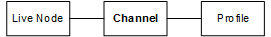
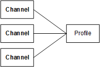
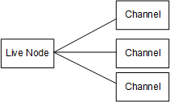

# Components of Elemental Live in a

cluster

When you work with Elemental Live using Conductor Live, you work with channels
(events), profiles, and nodes.

**Channels and Events**

A _channel_ is a session that decodes
and encodes a live video stream or a video file and produces a live output.
Video input comes into the channel and video output is the final outcome of
the channel. All the encoding activity occurs within a channel.

The channel that you create using Conductor Live becomes an event on the Elemental Live
node.

**Profiles**

The encoding activity is defined in a _profile_: the information contained in the profile includes the
source of the video input, the kinds of processing that the video will
undergo, the types of output protocols to produce (for example, Archive or
UDP/TS), and the types of outputs (the containers).

**Nodes**

The physical computer where the video activity is handled is called a
_node_. When you are deploying Conductor Live,
nodes are grouped into a cluster: by adding a node to a cluster, you make it
known to Conductor Live. If a node is not in a cluster, it is not being managed by
Conductor Live.

**Channel – Profile – Node
Association**

When you create a channel, you associate it with one profile and one
node. So the associations between these three entities is via the
channel.

In addition, keep the following in mind:

- One profile can be used by multiple channels: so profiles are
  multi-use.

- One node can handle multiple channels: so nodes are
  multi-taskers.

