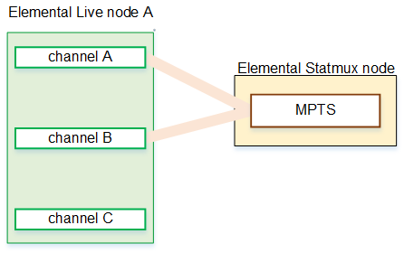
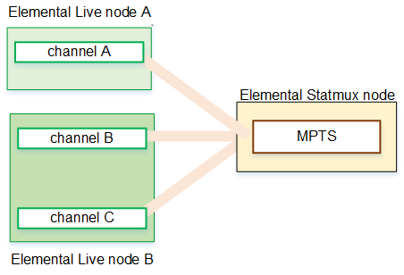
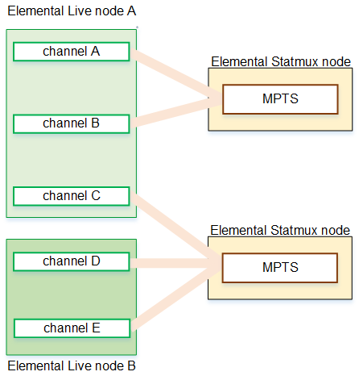
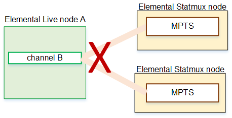
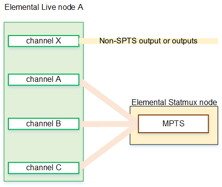

# Number of primary Elemental Live

nodes

Determine the number of _primary nodes_ you need:

- You need at least sufficient Elemental Live nodes to run the channels
  for all the encoding workflows and MPTS workflows.
- You don't need to run each SPTS channel on its own node. A
  node can run multiple channels, including multiple SPTS
  channels.
  After you have determined the number of primary nodes, you should
  identify your redundant node requirements. See [Worker node redundancy](redundancy-worker.md "redundancy-worker.md").

**Rules for association between SPTS channels
and the MPTS**

The following rules help you identify the number of nodes that you
need.

The SPTS channels for a single MPTS can originate from one node.

Or the SPTS channels can originate from two or more nodes.

A node can contain SPTS channels that go to different MPTSes.
There is no requirement for a node to be dedicated to one MPTS. In
the following diagram, node A contains SPTS channels for two
different MPTSes.

An SPTS channel can't be used by two different Statmux MPTS.

A node that has SPTS channels can also produce other channels
(events). The node doesn't have to be dedicated to producing SPTSes.

