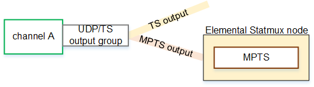
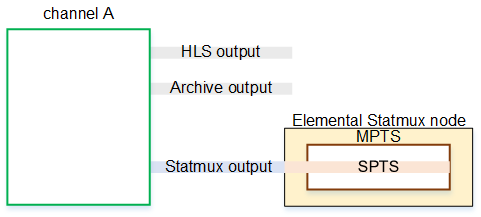

# Creating a standard

MPTS

This section describes how to create a standard MPTS. A standard
MPTS is one where each STPS programs comes from a channel that is
run on an Elemental Live node in the cluster. The SPTS programs can be any
mix of VBR and CBR programs. The MPTS is fixed bandwidth, but the
programs can be a mix of VBR and CBR programs.

**Assumptions**

This section assumes the following:

- You know how to create profiles and channels using AWS Elemental Conductor Live.
- You are familiar with the encoding features of AWS Elemental Live.
- You are familiar with the purpose of SPTS and MPTS, and of
  muxing and statmuxing.
- You are familiar with the structure of an SPTS and MPTS,
  and specifically with SI/PSI tables, with programs, and with
  handling of packets in the transport stream.

###### Topics

- [Step 1: Create the
  profiles and SPTS channels](#mpts-design-channel "#mpts-design-channel")
- [Step 2: Create the MPTS and
  add channels](#mpts-design-create "#mpts-design-create")
- [Handling by
  Elemental Statmux](#mpts-design-handling "#mpts-design-handling")

## Step 1: Create the

profiles and SPTS channels

You perform these steps in Conductor Live. You don't perform them on
Elemental Live.

1.  Design the profile for each SPTS channel.
    - Identify the input or inputs. The SPTS channel
      can use any Elemental Live inputs.
    - Identify the features you want to enable. For
      example, ad avails via SCTE-35 and motion
      overlay. There are no special rules about
      features that can be enabled in an MPTS channel.
      The channel follows the same rules as a regular
      Live event.
    - Identify the outputs you want to
      create:
      - You must always include one UDP/TS
        output that you configure for the MPTS.
        This output is called an _MPTS
        output_.
      - You can also include other UDP/TS
        outputs, for delivery to a regular UDP
        server.
      - You can include any number of outputs
        of another type. For example, you can
        include an HLS output group in order to
        produce an ABR stack for an OTT
        workflow.

    - Identify fields in the profile that you must
      set up as profile parameters. For more
      information about profile parameters, see [Working with
      channel parameters in a profile](creating-a-profile-with-channel-parameters.md "creating-a-profile-with-channel-parameters.md").

2.  As part of the design of the _MPTS_ output (in the UDP/TS output
    group), consider the following:

        * You must set up to include the SI/PSI tables
         that Elemental Statmux requires — the PAT and the
         PMT.

        * You can include or exclude the NIT, SDT, and
         TDT tables. In the MPTS, you have the
         opportunity to configure them again, for the
         entire MPTS.
        * You don't set the PIDs for the video, the
         audio, most captions, or the PCR.

        * You can choose to include ancillary data such
         as SCTE 35 and Nielsen ID3 data. But in all
         cases, you don't set the PIDs.

    When Elemental Live creates the output, it creates a PMT that
    references all the included streams, and it creates a
    PAT. It creates other tables according to the channel
    instructions.

3.  Create the profile. For more information, see [Creating a profile from
    scratch](creating-a-profile-from-scratch.md "creating-a-profile-from-scratch.md").
4.  Create the channels for all the profiles that you have
    created. Create the channel in the way that you create
    any channel using Conductor Live. You can create the channel
    [from
    scratch](creating-a-channel.md "creating-a-channel.md"), or you can [duplicate](creating-a-channel-by-duplicating.md "creating-a-channel-by-duplicating.md") an existing channel.

**Rules**

The following rules apply to the Elemental Live profiles and
channels:

- Everything about the profile can be identical to a
  regular profile used by a non-SPTS channel, except for
  the outputs. The profile must include one UDP/TS output
  that is set up for MPTS.
- The channel can produce a UDP/TS output group that
  produces two outputs, one that is a regular SPTS (not a
  statmux SPTS), and one that is a statmux output. You
  might create this TS output as a _monitoring output_. Creating this output
  doesn't add to the workload on the channel.

- The channel can include both statmux outputs and
  non-statmux outputs. These non-statmux outputs can be of
  any type, including other UDP/TS outputs (that go to
  other destinations).

## Step 2: Create the MPTS and

add channels

Create an MPTS. To create the MPTS, see [Creating a standard
MPTS](setting-up-mpts-outputs.md "setting-up-mpts-outputs.md"). The MPTS appears in the
list of MPTSes.

Then [add channels](step-d-add-channels-to-the-mpts-output.md "step-d-add-channels-to-the-mpts-output.md") (SPTS programs) to the MPTS. Specify a
channel that exists in the cluster. This channel only ever has
one program, so there is no need to tell MPTS which program to
extract.

For each program you add, you can assign the following:

- Data to use in the SI/PSI tables in the output
  MPTS.
- PIDs to assign to this program in the output MPTS.
- The bitrate range for this program in the MPTS.
- Locations for the different types of communications
  that occur between the Elemental Live node and the Elemental Statmux node.

For much of this information, if you don't specify values,
Elemental Statmux automatically assigns values when you save the MPTS. Elemental Statmux
ensures that valid PIDs are assigned throughout the MPTS.

## Handling by

Elemental Statmux

When Elemental Statmux ingests each SPTS program, it handles the data as
follows:

It uses the PAT and PMT to extract all the streams from the
program—the video, audio, and so on.

It reads any of the optional tables, such as the SDT.

It uses the extracted data to create one set of new tables for
the MPTS. If a program didn't include an optional table (such as
the SDT), Elemental Statmux uses the information that you might have
specified directly in the MPTS. Elemental Statmux assigns the standard PIDs
to the tables.

Elemental Statmux assigns new numbers to program streams, in order to
avoid conflict when two SPTS programs use the same PID for the
same stream. Elemental Statmux provides fields where you can assign new
numbers. But typically in a standard MPTS, you let Elemental Statmux
automatically assign numbers.

Elemental Statmux also generates its own NULL packets, to pad the MPTS
and ensure a constant bitrate.
