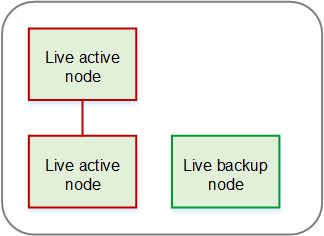
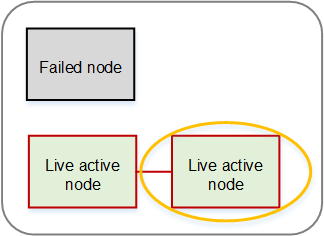

# 1-to-1 Plus

redundancy

## Setup

The 1-to-1 Plus redundancy group is the same as a 1-to-1
redundancy group except that it adds one backup (inactive)
node.

The behavior for starting and running a channel (or MPTS)
is identical to the behavior in a 1-to-1 redundancy
group.

This diagram is an example of a 1-to-1 Plus redundancy
group for Elemental Live nodes. The same design applies to
Elemental Statmux nodes.

The backup node is dedicated to one redundancy group. One
backup node can't act as backup for two 1-to-1 redundancy
groups.

## What happens in

a failure

If one of the nodes fails, the other node continues to
process the content. There is a delay of a few seconds
before the output resumes. In addition, if the failure is in
an Elemental Statmux node, Conductor Live redirects the Elemental Live output to the new
Elemental Statmux node.

After Conductor Live has switched to delivering from the
second node, the backup node becomes an active node.
Therefore, immediately after the failure, there are three
nodes in the Active nodes list—the two active nodes and the
failed node.

This diagram illustrates the change in the group after one
node fails. This diagram is for Elemental Live but the same
pattern applies to Elemental Statmux.

## Considerations

- The two nodes must have identical
  capabilities.
- You should have a policy in place for recovering
  after a node failure. Decide whether you will
  immediately try to get the failed node back into
  production.
- When you get a failed node back into production,
  you must restart each channel or MPTS that was
  running on that node. You will then be back to the
  desired redundant setup for the
  nodes.
