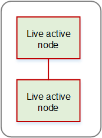
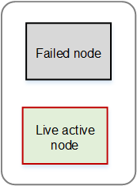

# 1-to-1 redundancy

## Setup

The redundancy group contains one pair of nodes that are
both active. You designate one node as the primary node, and
the other as the secondary node.

When you create a channel or MPTS, you assign the node to
the primary node. As soon as you save the channel, Conductor Live
automatically duplicates the channel (or MPTS) onto the
secondary node. If you later make changes to the channel or
MPTS, Conductor Live automatically applies those changes to the
channel or MPTS on the secondary node.

You start the channel or MPTS on the primary node. Conductor Live
automatically starts the channel or MPTS on the secondary
node. In this way, the two nodes are both _hot._

This diagram is an example of a 1-to-1 redundancy group
for Elemental Live nodes. The same design applies to Elemental Statmux
nodes.

## What happens in a

failure

If one of the nodes fails, the other node continues to
process the content. There is a delay of a few seconds
before the output resumes.

This diagram illustrates the change in the group after one
node fails. This diagram is for Elemental Live but the same pattern
applies to Elemental Statmux.

## Considerations

- The two nodes must have identical
  capabilities.
- You should have a policy in place for recovering
  after a node failure. Decide whether you will
  immediately try to get the failed node back into
  production.
- When you get a failed node back into production,
  you must restart each channel or MPTS that was
  running on that node. You will then be back to a
  redundant setup for the nodes.
