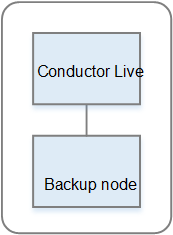

# Conductor Live node redundancy

You need two Conductor Live nodes to implement Conductor Live node redundancy.
Otherwise, you need only one node.

We recommend that you set up the cluster with redundant nodes. If
you do, you obtain resiliency in the Conductor Live nodes. In addition, there
are some resiliency features available to Elemental Live and Elemental Statmux that only
apply if you have redundant Conductor Live nodes.

Redundant Conductor Live nodes are known as a _high
availability_ (HA) pair.

To set up redundant nodes, add two nodes to the cluster, then
create an HA redundancy group. When a problem occurs on the active
node, the backup node automatically takes over control of activity
in the cluster.

**How Failover works**

If the leader node fails, the backup automatically takes over
management of the cluster. The leader Conductor Live maintains the Conductor Live
database; the backup database is a copy of that leader database and
is continually being synchronized. The backup Conductor Live is continually
monitoring the leader.

As soon as the backup can no longer detect the leader on the
network, it assumes that the leader has failed and its takes over
the leader role. This change in role takes a few seconds.

.If
you resolve the problem with the failed leader Conductor Live node and bring it back into the
cluster, that leader node will take back control from the secondary Conductor Live
node.
