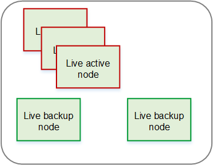
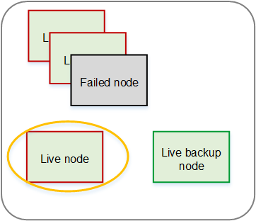

# N-to-M redundancy

## Setup

The redundancy group contains one or more active nodes and
one or more backup (inactive) nodes. In the group, you can
have the same number of active and backup nodes, or more
active nodes, or more backup nodes.

In one redundancy group, all the active nodes share the
backup nodes.

This diagram is an example of an N-to-M redundancy group
for Elemental Live nodes. The same design applies to Elemental Statmux
nodes.

## What happens in a

failure

If an active Elemental Live node fails, Conductor Live automatically moves
both the active and idle channels to a backup node, then
starts all the active channels. There is a slight delay
while the restart occurs.

If an active Elemental Statmux node fails, Conductor Live
automatically moves all the active and idle MPTSes to a
backup node, then starts all the active MPTSes. There is a
slight delay while the restart occurs. In addition,
Conductor Live ensures that the Elemental Live nodes send to the new
Elemental Statmux node.

There is a delay while the backup node starts up because
Conductor Live must copy the data from the failed node to the backup
node. During the delay, there is no output for the affected
channels or MPTSes.

This diagram illustrates the change in the group after one
node fails. This diagram is for Elemental Live but the same pattern
applies to Elemental Statmux.

## Considerations

- You must consider the capabilities of the
  different nodes in the redundancy group. For
  example, think about the repercussions if you have a
  backup node that isn't as powerful as the nodes that
  are usually your active nodes. Think about whether
  you want to take the risk of having less powerful
  nodes as backups.

Also consider how you will handle failure of a node that has SDI cards
installed. Ideally, there will be a backup node with the same card
configuration, especially if your deployment includes a router handling
the SDI input. You might want to consider organizing nodes that have SDI
cards in their own redundancy group.

- You should have a policy in place for handling
  node failure. Decide whether you will immediately
  try to get the failed node back into
  production.
- Keep in mind that it is possible to have so many
  nodes in a failed state that you have no backup
  nodes in the redundancy group.
