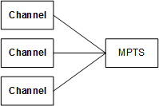

# Components of AWS Elemental Statmux in a cluster

To create an MPTS using Elemental Statmux, you need:

- Elemental Live channels that produce an SPTS output.
- An MPTS that you create using Elemental Statmux. Elemental Statmux*muxes* two or more SPTS outputs into one MPTS output.

