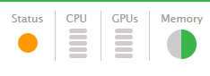

# Step A: Get ready

The following steps prepare you to perform a standard upgrade of an Conductor Live node.
Performing this procedure helps ensure you don't lose data due to a malfunctioning
node.

## Check essential notes

Refer to the essential notes in the [current Release Notes](../../../elemental-live.md "../../../elemental-live.md") to identify changes in behavior
with the upgrade.

## Verify the worker node type

The software installer that you use for the nodes varies depending on if you have
GPU-accelerated software type, or CPU-only. To determine the type of software, look
at any web interface screen of the worker node. The top shows icons as
follows:

- CPU and GPU icons: the software is
  _GPU-accelerated_.
- CPU icon only: the software is _CPU-only_.



## Save the latest database backup

Perform these steps on the primary Conductor node and all worker nodes in the
cluster.

When you install the upgraded operating system, your previous database backups are
deleted. Locate and save the most recent backup off the system. You can use this
backup later if you need to downgrade from the version that you are now
installing.

###### To save the latest backup

1. From a Linux prompt, log in to the appliance with the
   _elemental_ user credentials.
2. Navigate to the directory where Conductor Live saves its backups.

```
[elemental@host ~]$ `cd /home/elemental/database_backups`
```

3. Locate the most recent backup and save it to a location off of the AWS Elemental
   system. The backup name includes the date and time that the backup was
   taken, in a format similar to this:
   `elemental-db-backup_live_3.23.5_2018-02-08_21-01-36.tar`

## Create bootable kickstart

You must install the host operating system from an `.iso` file
onto each physical machine that will be running AWS Elemental software. Doing so is
referred to as “kickstarting the system”.

Make sure that you install the right version of the operating system with each
piece of software. The correct `.iso` file is available at
[AWS Elemental Support Center Activations](https://console.aws.amazon.com/elemental-appliances-software/home?region=us-east-1#/activations "https://console.aws.amazon.com/elemental-appliances-software/home?region=us-east-1#/activations").

###### Create a Boot USB Drive

Do this from your workstation.

Use a third-party utility (such as PowerISO or ISO2USB) to create a bootable USB
drive from your `.iso` file. For help, see the knowledge base
article [Creating Bootable Recovery (kickstart)
Media](https://us-east-1.console.aws.amazon.com/elemental-appliances-software/home?region=us-east-1#/viewknowledge/How-to-create-bootable-recovery-kickstart-media-Windows-and-Apple-OS-X "https://us-east-1.console.aws.amazon.com/elemental-appliances-software/home?region=us-east-1#/viewknowledge/How-to-create-bootable-recovery-kickstart-media-Windows-and-Apple-OS-X").

## Move custom files

If the primary Conductor Live or any worker nodes have custom AWS Elemental assets, such as
scripts, saved to `/opt/elemental_se/scripts`, then move them to a safe
location so they're not deleted during the upgrade.
