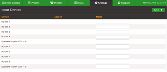

# Add SDI input devices

_Input devices_ are cards that are installed in the
hardware unit. The AWS Elemental Live node auto-detects the SDI card and creates an input in
Elemental Live as follows:

- One single-link input for each input on the card (so four inputs). Each input is given
  a unique numerical ID.
- One quad-link input, if the SDI card supports quad link.

The quad-link input is used with 4K quad input. When you're creating a profile or
event, select this quad-link input to indicate to Elemental Live that the four inputs on this
SDI card are the four parts of a quad-link input.
Once you have cabled the SDI cards, make sure that every input that has a cable appears in
the **Settings** > **Input Devices** screen. The following
image shows input devices in Elemental Live:

###### Naming Inputs

If you want, you can give the device a custom name.

1. On the Elemental Live web interface, hover over
   **Settings** and choose **Input Devices**. Elemental Live
   lists all of the detected input cards.
2. Enter a name and choose **Save**.

###### Note

If these input device cards are connected to a router, you need to now follow the
procedure for adding the router. See [Add SDI video routers](config-wrkr-lv-cg-sdi-rou.md "config-wrkr-lv-cg-sdi-rou.md").
