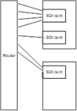

# Step D: Complete the output mappings

Map each router output to the SDI input on the Elemental Live hardware unit that you plan to use.
This mapping must reflect the actual cabling from the output side of the router to the input
side of the SDI card.

In the following example, the four inputs on the SDI card at the top have a path into the
router. The one and only input on the second card has a path to the router. And two of the
four inputs on the bottom SDI card have a path to the router.

###### To map the outputs

1. On the Elemental Live web interface, make sure you're on the **Edit Router**
   screen, as described in [Step C: Complete the input mappings](sdi-rou-input.md "sdi-rou-input.md"). Choose **Map
   Outputs**.
2. Complete the first line as follows:
   - **Output**: Select an output that is one of the cabled router
     outputs that you plan to use.
   - **Connected to**: Select the card and node that the router output
     is connected to.

###### Warning

Do not select any of the quad-link inputs. Elemental Live does not currently support 4K SDI
input via a router. 3. Choose **Add** (**+** icon). 4. Choose **Map Outputs** again and create a line for each router output
that is cabled.
