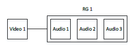
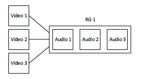
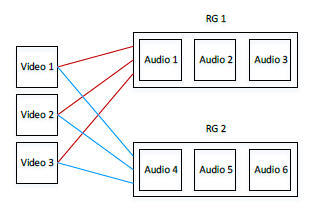
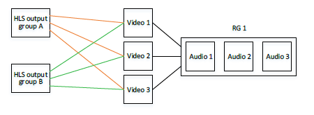
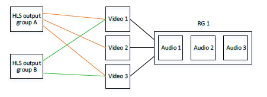

# Examples of HLS rendition

groups

## Example 1

The outputs in an HLS output group consist of:

- One video stream.

This video is associated with an audio rendition group that contains:

- One English stream.
- One French stream.
- One Spanish stream.

## Example 2

The outputs in an HLS output group consist of:

- One “video high” stream.
- One “video medium” stream.
- One “video low” stream.

Each of these videos is associated with the same audio rendition group that
contains:

- One English stream.
- One French stream.
- One Spanish stream.

## Example 3

The outputs in an HLS output group consist of:

- One video stream.

This video is associated with two audio rendition groups.

The first audio rendition group contains:

- One English stream in AAC codec.
- One French stream in AAC codec.
- One Spanish stream in AAC codec.

The second audio rendition group contains:

- One English stream in Dolby Digital.
- One French stream in Dolby Digital.
- One Spanish stream in Dolby Digital.

## Example 4

There are two output groups, one that pushes to a WebDAV server and the other that delivers
to an Akamai server.

Each output group is identical in terms of its video and rendition groups. For example,
each output group produces the video and rendition group from Example 2. You do not need to
encode the streams twice; do it only once for each output group. So long as the two output
groups are in the same event, each can be associated with the same streams.

## Example 5

There are two output groups, one that pushes to a WebDAV server and the other that delivers
to an Akamai server.

Each output group is similar in terms of its video and rendition groups. For example, the
first output group produces the video and rendition group from Example 2. The second output
group produces the only “video high” and “video low” but it is associated with the same audio
rendition group as the first output group.

