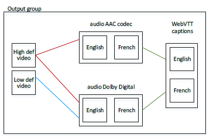

# Getting ready

to create HLS rendition groups

## Step 1.

Create a mapping

Identify the video, audio, audio rendition groups and captions you require. Review the
[Rules for rendition
groups](hls-rendition-groups-rules.md "hls-rendition-groups-rules.md") to ensure you design an output that is valid. For
example:

- Video “high definition.”
- Video “low definition.”
- A rendition group named “AAC group” for AAC audio.
- A rendition group named “Dolby group” for Dolby Digital audio.
- Audio English AAC in “AAC group” rendition group.
- Audio English Dolby Digital in “Dolby group” rendition group.
- Audio French AAC in “AAC group” rendition group.
- Audio French Dolby Digital in “Dolby group” rendition group.
- Video “high definition” to be associated with both rendition groups.
- Video “low definition” to be associated with the “Dolby group” rendition group.
- Captions in English and French in WebVTT format, to be associated with both rendition
  groups.

## Step 2. Determine defaults and auto-selection behavior

For each audio rendition group, decide which audio will be the default and how
auto-selection works for the non-defaults. Setting up this information is useful if:

- The user has specified an audio preference on the client player but that preference is
  not available, or
- If the user has not specified an audio preference.

(Obviously, if the user has specified a preference and that preference is available, the
client player will select that preference.)

Set the Audio Track Type field. The options for this field for each audio stream follow.

| Value                                     | Client player behavior                                                                                                                                                               | Representation in HLS manifest               |
| ----------------------------------------- | ------------------------------------------------------------------------------------------------------------------------------------------------------------------------------------ | -------------------------------------------- |
| Alternate Audio, Auto Select, Default     | The client player should \*select • this stream. Only one stream in the rendition group should be set as the default; otherwise, the client player may behave unexpectedly. | EXT-X-MEDIA with DEFAULT=YES, AUTOSELECT=YES |
| Alternate Audio, Auto Select, Not Default | The client player \*may • select this stream. Any number of streams in the rendition group can be set this way.                                                                | EXT-X-MEDIA with DEFAULT=NO, AUTOSELECT=YES  |
| Alternate Audio, not Auto Select          | The client player \*should never • select this stream. Any number of streams in the rendition group can be set this way.                                                       | EXT-X-MEDIA with DEFAULT=NO, AUTOSELECT=NO   |
| Audio-Only Variant Stream                 | The client can play back this audio-only stream instead of video in low-bandwidth scenarios.                                                                                      | EXT-X-STREAM-INF                             |

1. Set the **Alternate Audio Track Selection** as
   follows:

| Desired result                                                                     | How to set                                                                                                                                                                                                                                                             |
| ---------------------------------------------------------------------------------- | ---------------------------------------------------------------------------------------------------------------------------------------------------------------------------------------------------------------------------------------------------------------------- |
| There is a default. The player can auto-select any of the other audios.            | • Set only one audio stream to “Alternate Audio, Auto-Select, Not Default, Default.” • Set every other audio stream to “Alternate Audio, Auto-Select, Not Default.”                                                                                           |
| There is a default. The player cannot auto-select any of the other audios.         | • Set only one audio stream to “Alternate Audio, Auto-Select, Not Default, Default.” • Set every other audio stream to “Alternate Audio, not Auto-Select.”                                                                                                       |
| There is a default. There are specific audios that the player can auto-select.  | • Set only one audio stream to “Alternate Audio, Auto-Select, Not Default, Default.” • Set some of the other audio streams to “Alternate Audio, Auto-Select, Not Default.” • Set some of the other audio streams to “Alternate Audio, not Auto Select.” |
| There is no default. The player can auto-select any audio it chooses.              | • Set every audio stream to “Alternate Audio, Auto-Select, Not Default.”                                                                                                                                                                                               |
| There is no default. The player cannot auto-select any audio.                      | • Set every audio stream to “Alternate Audio, not Auto-Select.”                                                                                                                                                                                                        |
| There is no default. There are specific audios that the player can auto-select. | • Set some audio streams to “Alternate Audio, Auto-Select, Not Default.” • Set some audio streams to “Alternate Audio, not Auto-Select.”                                                                                                                            |

2. In addition, if you have an audio that is intended as the audio to play when the
   bandwidth is so low that the video cannot be delivered, then set that audio to “**Audio-Only Variant Stream**.”
