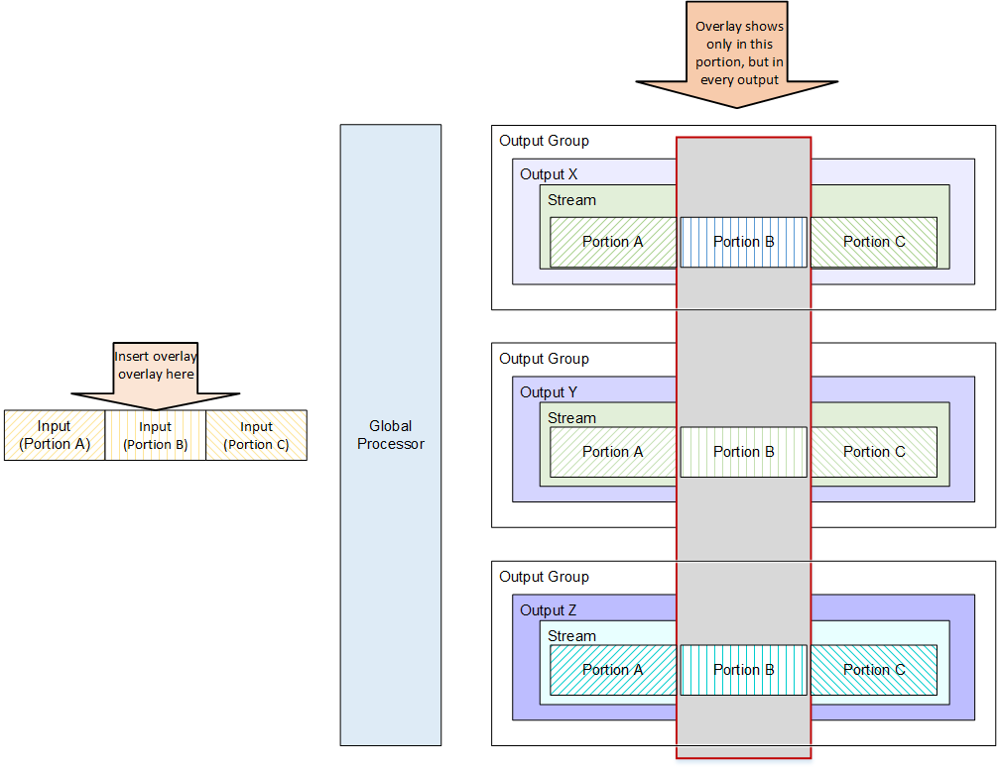
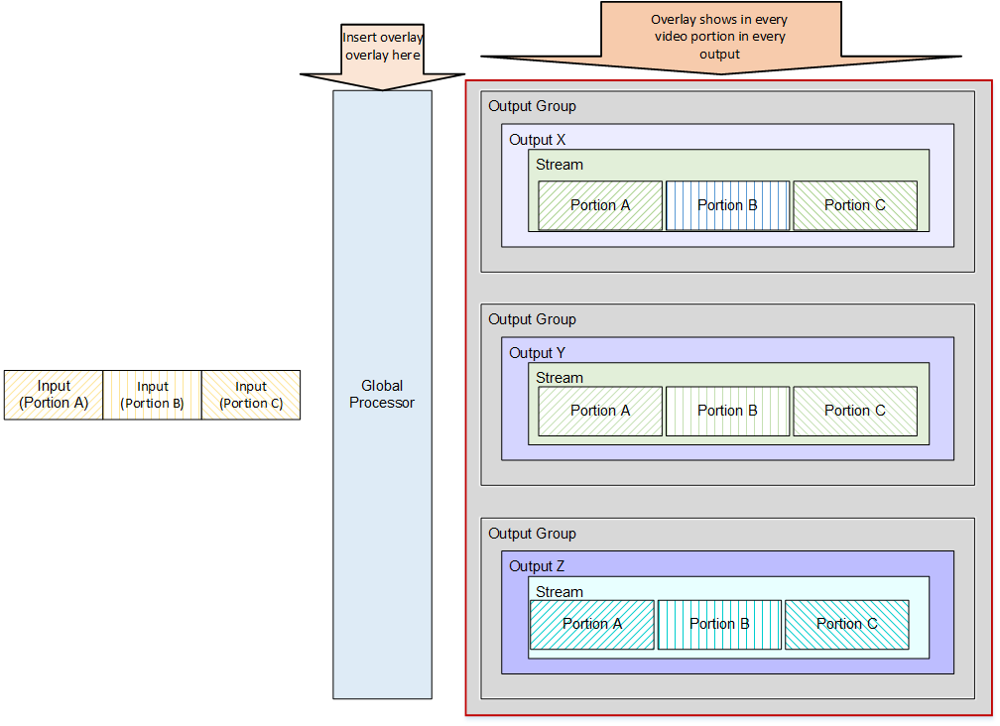
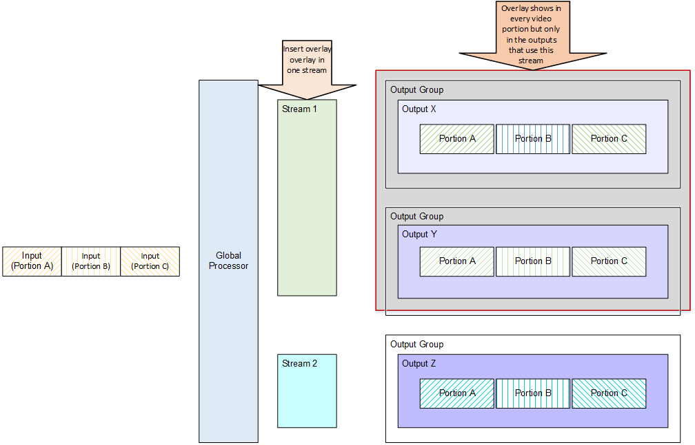

# Insertion options and the effect on outputs

## In the input section: Insert in portion of all outputs

The static overlay can be inserted in the input section in a specific input.

Result: the portion of the output that is sourced from the given input includes
the static overlay.

A typical use case for inserting in this section is if some of the inputs already
have a static overlay in the desired location; you do not want to insert another
static overlay over this existing static overlay. Therefore, you would insert the
static overlay into the inputs that do not have an existing static overlay and omit
it from inputs that do have an existing static overlay.

The static overlay will be burned into the video in this input after the input is
decoded and before any global processors. This means that the static overlay “sticks”
to its input; if the specified start time and duration extend beyond the end of the
input, the static overlay will end when the input ends.

If you insert at the Input stage, be very careful with the start time and
durations of the static overlays to avoid the static overlay ending abruptly.

## In the Global Processors section: Insert in all outputs

The static overlay can be inserted in the Global Processors section. Result: The
static overlay will be inserted in all outputs.

The static overlay is burned into the video after decoding and input-specific
processing and before encoding and creation of individual streams and outputs.

## In

the Output section: Insert in one stream

The static overlay can be inserted in individual streams.

Result: The static overlay is inserted only in the outputs that are associated
with those streams. The static overlay will be burned into the video only in the
specified streams.

## Overlay scaling for each insertion option

The following lists the overlay scaling for each insertion option:

- If you insert the overlay in an input, then when (and if) the underlying
  video in each output is scaled up or down, the overlay is similarly scaled. The
  underlying video and overlay maintain their relative ratios. For example, if
  the overlay covers one quarter of the underlying video in the input, it will
  cover one quarter of the underlying video in every output.
- If you insert the overlay in the global processors section, then when (and
  if) the underlying video in each stream assembly is scaled up or down, the
  overlay is similarly scaled.
- If you insert the overlay in a stream assembly section, then when (and if)
  the underlying video in each stream assembly is scaled up or down, the overlay
  is not scaled. The overlay is added only after scaling. Therefore, if the event
  has two stream assemblies, the final effect of the overlay may be different.
  The overlay in one stream assembly may take up more room on the underlying
  video than the overlay in a stream assembly with a different resolution. But
  the advantage of adding in the stream assembly section is that you can specify
  different overlays for each assembly, each sized appropriately for that
  stream’s resolution.
