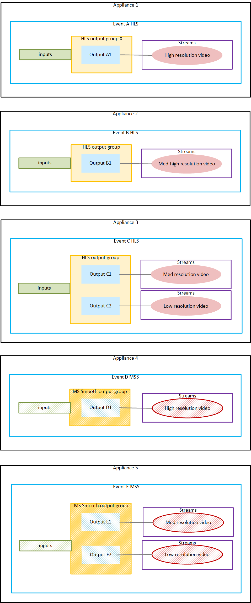

# Example of a workflow

This section provides an example of the design of an output lock
workflow that implements distributed encoding.

###### Note

This example refers to _pools_.
For an explanation of pools, see [Output locking pools](opl-pools.md "opl-pools.md").

The following example workflow has two output packages: HLS and MS
Smooth. Notice how the ABR stacks are divided into several events within
each package. This division is driven by the processing demands on the
encodes. Notice that when two outputs are on the same appliance, they
can share the same output group.

Pay attention to the pools that are implied by this design:

- There are two event pools for five events. One pool contains
  events A, B, and C. One event contains events D and E.
- There are two output group pools. One pool contains the three
  HLS output groups, shown in yellow. The other contains the two MS
  Smooth output groups, shown in striped yellow.

- There are two output pools. One pool contains four HLS outputs,
  shown in blue. The other contains three MS Smooth outputs, shown in
  striped blue.
- There are two encode pools. One pool contains four HLS encodes,
  shown in red. The other contains three MS Smooth outputs, shown in
  striped red.

