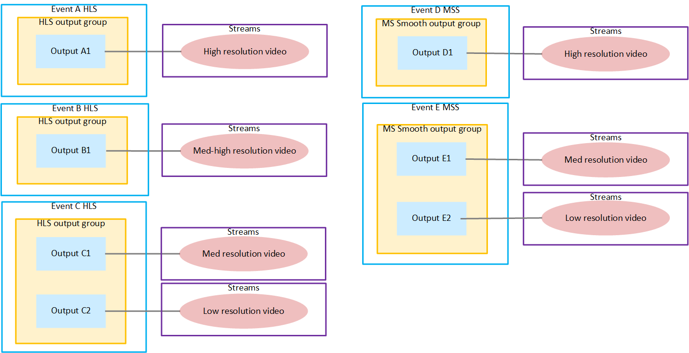

# Output locking pools

The events that are locked together are in a _pool of locked events_. The outputs in these events are part
of a _pool of locked outputs_. The
encodes in the locked outputs are part of a _pool
of locked encodes_.

If you have a workflow with several types of output groups, it's
important to keep track of the pools. If you don't keep track of the
pools, you might break the rules for output locking.

The following diagram illustrates the event setup to produce an HLS
ABR stack (with four renditions), and a Microsoft Smooth Streaming ABR
stack (with three renditions), all from the same source. The following
pools exist:

- Events A, B, and C are one pool of locked events for the HLS ABR stack.
- Events D and E are another pool for the Microsoft Smooth Streaming
  ABR stack.
- Outputs A1, B1, C1, and C2 are one pool of locked outputs.
- Outputs D1, E1, and E2 are another pool of locked outputs.

- The four streams in the HLS events are a pool of locked encodes.
- The three streams in the Microsoft Smooth Streaming events are
  another pool of locked encodes.

