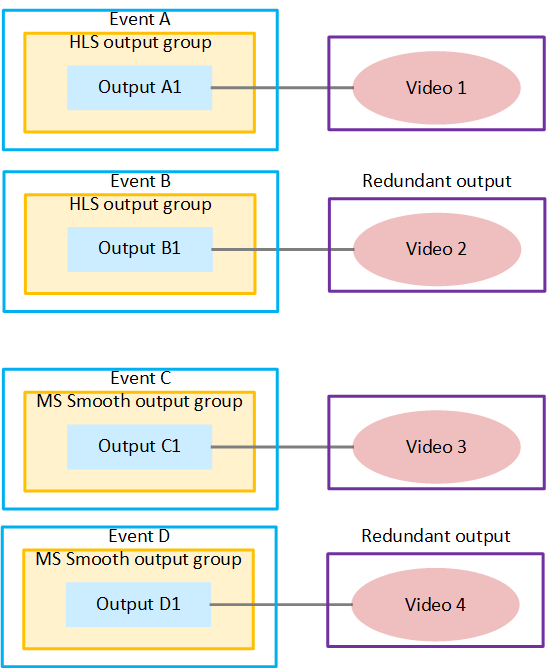

# Output locking pairs

In an output redundancy implementation, there are also redundant pairs
of events, outputs, and encodes. Encode pairs are typically
identical.

If you have a workflow with several types of output groups, it's
important to keep track of the pairs. If you don't keep track of the
pairs, you might break the rules for output locking.

The following diagram illustrates the event setup to produce a
redundant HLS output and a Microsoft Smooth Streaming output, all from the
same source. The following pairs exist:

- Events A and B are a redundant pair of events. Events C and D are
  another redundant pair.
- Outputs A1 and B1 are a redundant pair of outputs. Outputs C1 and
  C1 are another redundant pair.
- Videos 1 and 2 are a redundant pair of encodes. Videos 3 and 4 are
  another redundant pair.

