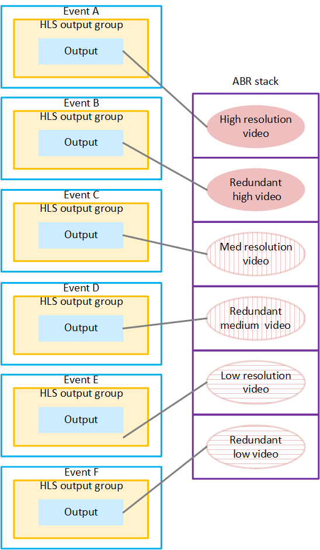

# Use case 3:

Distributed encoding with output redundancy

You might combine distributed encoding with output redundancy, and
also include output locking. For example, you might create three events,
each producing a separate output. To add redundancy, duplicate each of
those events (outputs) to create _event
pairs_. Then to include output locking, make sure that each
event in the pair is on a different appliance.

In the following illustration, event A and event D are a pair. The high-resolution video
that event A produces is identical to the high-resolution video that event D produces.
Similarly, event B and event E are a pair, and event C and event F are a pair.

In this scenario, the downstream system must determine that there
are duplicates of each rendition. The downstream system decides which
outputs to choose initially, to construct the ABR stack. Then later, if
there is a problem with one of the initial renditions of the stack, the
downstream system must be able switch to the other rendition.

The following diagram illustrates a setup that combines distributed
encoding and redundancy. There are three pairs of redundant events. In
each pair, the two events produce the same rendition.

