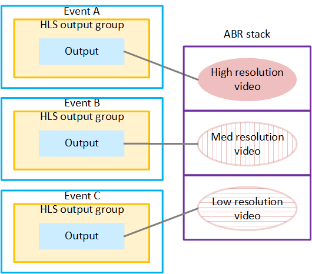

# Use case 2: Distributed encoding

You can set up output locking to implement distributed encoding. A typical use case for
distributed encoding is to build an ABR stack that consists of different renditions
(resolutions) of the same video content.

You can set up two or more events, each on a separate appliance. All
the events handle the same sources, but each event produces different
parts of the ABR stack. The source content for all the events is always
identical, so the video picture in all the outputs is identical.

You set up all the events so that their outputs are locked together.
In this way, all the outputs are frame accurate with each other—the
exact same frame has the exact same timecode.

The downstream system receives all of the outputs. The downstream
system has been set up to put the ABR stack together. The downstream
system can use the timecodes to synchronize the frames. In this way,
when the player switches from one rendition to another, the switch
occurs with no missing frames and with no duplicate frames.

The following diagram illustrates a setup of several events that
together produce the outputs for an ABR stack.

