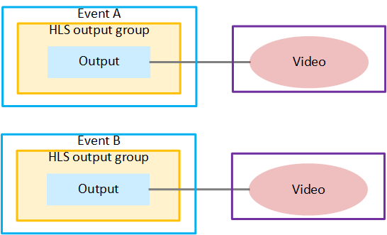

# Use case 1: Enhancing

output redundancy

You can implement output locking to enhance output redundancy. You can
set up output redundancy to work on the same or different
Elemental Live appliances:

- If you set up both events on the same appliance, you achieve resiliency if there is
  a problem with one event. However, if the entire appliance fails, both outputs stop, and
  there is no fallback.

- If you set up each event on a different appliance, you achieve resiliency if there
  is a problem with one event or if the entire appliance fails. If the entire appliance
  fails, the other event (on the other appliance) still provides output to the downstream
  system.
  **Adding output locking**

You can add output locking to output redundancy. When you do this,
the failover from one output to the other is seamless:

- Without output locking, the two outputs are probably not frame
  accurate with each other. At a specific timecode, the content in the
  frame in one output is not identical to the content in the frame in
  the other output. When the downstream system switches between
  outputs, there might be a noticeable repetition of a few frames. Or
  there might be a noticeable discontinuity.
- With output locking, the two outputs are frame accurate with
  each other. At a specific timecode, the content in both outputs is
  identical. The downstream system can use the timecode to synchronize
  the content when it switches from one output to the other. In this
  way, the switch is seamless. There are no duplicate frames and no
  missing frames.
  Output locking ensures a seamless failover because the outputs are frame accurate with
  each other. The exact same frame has the exact same timecode. The outputs are locked
  together.

When you add output locking to an output redundancy setup, you must
set up each event on a different appliance.

The following diagram illustrates a typical setup of two events that
are a redundant pair.

