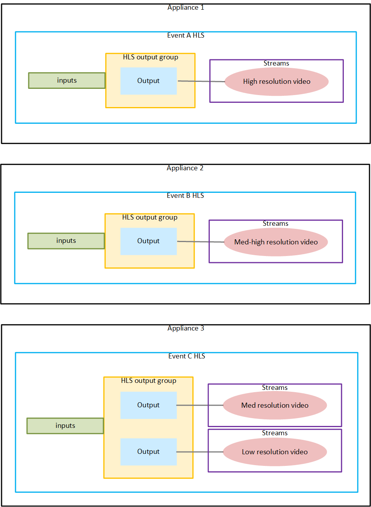

# Requirements for inputs

and outputs

This section describes the requirements for source inputs and outputs, their
characteristics, and which work for output locking.

###### Note

This section refers to _pools_ and
_redundant pairs_. For an explanation
of pools, see [Output locking pools](opl-pools.md "opl-pools.md"). For an explanation of pairs,
see [Output locking pairs](opl-redundant-pairs.md "opl-redundant-pairs.md").

###### Topics

- [Supported input
  types](#opl-requirements-input-types "#opl-requirements-input-types")
- [Input
  requirements](#output-locking-input-requirements "#output-locking-input-requirements")
- [Supported output
  types](#opl-requirements-output-types "#opl-requirements-output-types")
- [Output encode
  requirements](#output-locking-output-requirements "#output-locking-output-requirements")
- [Output locking and SCTE
  35](#opl-requirements-scte35 "#opl-requirements-scte35")

## Supported input

types

Elemental Live supports output locking with the following types of
inputs:

- HLS network inputs. Output locking isn't supported with HLS file
  inputs.
- SDI sources: SDI inputs, 4K Quadrant SDI inputs, 4K 2SI
  inputs,
- TS sources: RTP network inputs, SMPTE 2022-6 inputs, SMPTE
  2022-7 inputs, SRT inputs, UDP network inputs.
- RTMP inputs.

- RTSP inputs.

## Input

requirements

For output locking to be successful, the video sources must meet
strict requirements.

**Input timecode**

The inputs must have a timecode in the source. If the timecode is
missing from the source, the event will fail to start.

Different types of sources support different types of
timecode:

- HLS live sources: Embedded timecode.
- Inputs that are SDI sources: Embedded or LTC timecode. All the inputs in one event
  must have the same timecode source. The inputs can't switch from embedded to LTC. All
  inputs across the pool of locked events must have the same timecode.
- Inputs that are transport stream sources: Embedded
  timecode.

The timecode with standard output locking must be HH:MM:SS:FF
format.

The timecode with epoch locking must be epoch time in UTC.

###### Note

Both output locking and epoch locking require a timecode in every
source.

**Video is required**

Output locking isn't supported in an audio-only event.

**Video characteristics**

The sources for all of the events must be identical. Specifically, the outputs won't be
frame accurate if the following video characteristics vary across the sources:

- Frame rate. The frame rates in the different sources can have different frame rates
  that are whole number multiples of each other. For example, 30 fps and 60 fps.

- Scan type (progressive versus interlaced).

Note that these are the only characteristics that must be identical
in all sources. Other characteristics, including resolution and GOP
structure (I-frame, B-frame, and P-frame patterns) can be
different.

## Supported output

types

Elemental Live supports output locking with the following types of
outputs:

- HLS output group
- MS Smooth output group
- UDP/TS output group

###### Note

All output groups in the event must implement output locking. If
an output group can't implement output locking, you can't include it
in the pool of locked events.

Even when an output group doesn't support output locking, you
can't include it in the output locking event. For example, the event
can't include a DASH output group.

## Output encode

requirements

For output locking to be successful, the video outputs must meet
strict requirements.

### Video codec

The video encodes must use H.264 or H.265.

Within a pool of locked encodes, the codecs can be different, as long as they're
always H.264 or H.265.

In a redundant pair of encodes, the codecs must be the same.

### Frame rate

There are two sets of rules for the frame rate:

- Rule for the frame rate conversion from the source to the output encode.

- Rule for the frame rates in all output encodes in the pool of events.

**Rule 1: Conversions from the source to the output encode in the
same output**

Simple conversions are allowed. The conversion between the input frame and the desired
output frame rate must be _simple_, which means that one
of these statements must apply:

- The output encode frame rate must be a whole number multiple of the source frame
  rate. For example, the source frame rate might be 30 FPS, and the output encode frame
  rate might be 60 FPS.
- The source frame rate must be a whole number multiple of the output encode frame
  rate. For example, the source frame rate might be 60 FPS, and the output encode frame
  rate might be 30 FPS.

With these rules, it is possible for the frame rates to be integers. For example, if
the source frame rate is 29.97 FPS and the output encode frame rate is 59.94 FPS.

Complex conversions aren't allowed. The following are examples of _complex_ frame rates. You can't use the input if combinations
like these apply to your channel:

- Source FPS is 59.4, output FPS is 60.
- Source FPS is 45, output FPS is 60.

**Rule 2: Frame rates in the outputs in the output
pool**

The frame rates in the output encodes in the pool of locked outputs can all be
different. However, they must be whole number multiples of each other.

**Example**

In the following diagram, all of the inputs are from the same
source. Therefore, they have the same frame rate.

Rule 1: In each event, each video encode (the oval inside the
stream) must have a frame rate that is a simple conversion of the
source frame rate.

Rule 2: All the encodes can have a different fran rate, but they
must be whole number multiples of each other.

## Output locking and SCTE

35

**Epoch locking and SCTE 35**

To include SCTE 35 messages in the outputs, you can't implement
epoch locking. The presence of SCTE 35 messages is not compatible with
the segment length requirements for epoch locking.

If the inputs contain SCTE 35 messages, make sure that you don't [pass them through to the output](pass-through-or-removal.md "pass-through-or-removal.md").

**Inserting SCTE 35 messages via the REST
API**

You can implement standard output locking if you want to include
SCTE 35 messages in the outputs. The messages can be in the source
and/or added when the event is running:

- The SCTE 35 messages can be messages that you [pass through from the
  source](pass-through-or-removal.md "pass-through-or-removal.md").
- Or they can be messages that you [insert into a running
  event](scte-35-message-insertion.md "scte-35-message-insertion.md"), using the REST API.

In this case, make sure to include a time buffer between the time that you enter the
message and the time for that message. In other words, don't enter an _immediate_ start time for the cue out or the cue in.

A message with an immediate start can compromise the frame accuracy of the pool of
locked outputs.
