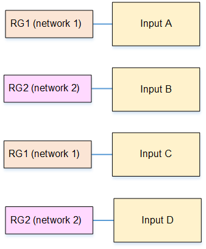
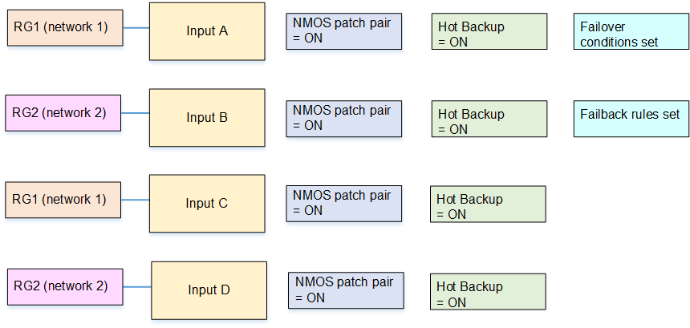
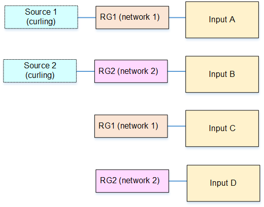
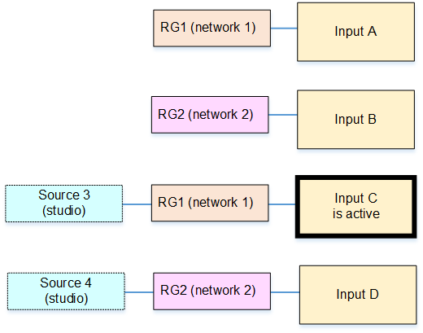
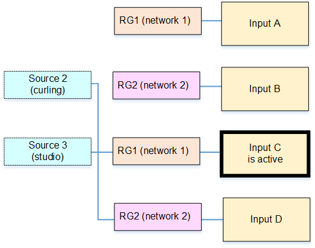
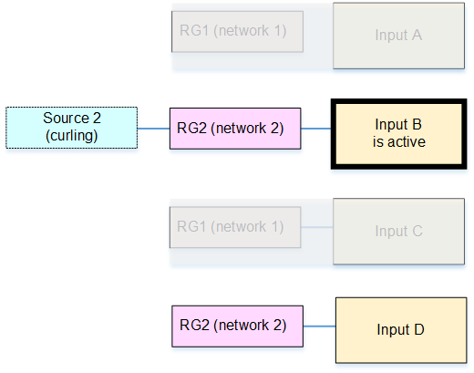

# Resiliency scenario C:

Supporting NMOS patching and network failover

You can set up inputs in a configuration that combines NMOS patching with hot backup
and network redundancy. In this scenario, the hot backup configuration allows failover
between the redundant networks that are set up between the upstream system (the content
source) and Elemental Live. Network redundancy lets Elemental Live fail over to sources that are being
delivered over a different network, if the main network fails. Network redundancy lets
you fail over to a different live source, instead of failing over to a slate (as shown
in scenario B).

Assume that the event is a curling game with two cameras, one on the curling rink and
one in the studio. You have set up your upstream system with the following
sources:

- Source 1: Content from the camera on the curling rink, routed over network

1.

- Source 2: Content from the camera on the curling rink, routed over network

2.

- Source 3: Content from the studio, routed over network 1.
- Source 4: Content from the studio, routed over network 2.

###### Topics

- [Setup steps](#s2110-nmos-c-steps "#s2110-nmos-c-steps")
- [Result of the setup](#s2110-nmos-c-result "#s2110-nmos-c-result")
- [Set up the sources on the NMOS
  controller](#s2110-nmos-c-controller-setup "#s2110-nmos-c-controller-setup")
- [How patching works at runtime](#s2110-nmos-c-patch-in-action "#s2110-nmos-c-patch-in-action")
- [How failover works at
  runtime](#s2110-nmos-c-failover-in-action "#s2110-nmos-c-failover-in-action")

## Setup steps

To set up SMPTE 2110 sources in this way, follow this procedure.

1.  Create two receiver groups, one for network 1 and one for network 2. For
    example, RG1 and RG2. To create a receiver group, see [Create the receiver group](s2110-nmos-create-receiver-group.md "s2110-nmos-create-receiver-group.md").
2.  In the Elemental Live event or Conductor Live profile that you are creating, create four
    SMPTE 2110
    NMOS inputs. Set up each input with the receiver groups, as
    follows:

        * Input A. Set the Input type to RG1.
        * Input B. Set the Input type to RG2.
        * Input C. Set the Input type to RG1.
        * Input D. Set the Input type to RG2.

    For detailed instructions, see [Create a receiver group input](s2110-nmos-create-input.md "s2110-nmos-create-input.md").

You now have four inputs in the order A, B, C, D.

 3. Turn on **NMOS patching pair** in all these inputs. 4. Turn on **Hot Backup** in all these inputs. 5. Make these changes in input A:

    * Create as many failover conditions as you want. To create one
     condition, click **Add Failover Condition**. In
     **Description**, choose the type of condition, for
     example **Input Loss**. In
     **Duration**, enter the length of time the condition
     must continue before the condition triggers a failover to input B.
    * Ignore the **Error Clear Time** and
     **Failback Rule** fields.

6. Make these changes in input B:
   - **Error Clear Time**: Enter a time. After all the
     failover conditions are no longer applicable Elemental Live waits for the
     specified time before it fails back to input A.
   - **Failback Rule**: Choose a rule to specify how Elemental Live
     fails back to input A.

7. On inputs C and D, _don't_ set up failover
   conditions, error clear times or failback rules.

## Result of the setup

You have now set up the four inputs as shown in the following diagram. All inputs
have hot backup enabled and all have patching enabled.

Elemental Live proceeds as follows:

- Elemental Live sets up a hot-backup pair.

Inputs A and B have failover conditions and failover rules set, so Elemental Live
considers them to be a hot-backup pair.

- Elemental Live next sets up the patching pairs.

It sets up input A with input C, and sets up input B with input D.

Inputs C and D have hot backup enabled. But they aren't standard backups.
Instead, they shadow the A/B input patching pair:

    + The failover conditions for input A apply to input C.
    + And the failback conditions of input B apply to D.

To summarize:

- Input A. Its hot backup is input B. Its patching pair is input C.
- Input B. Its hot backup is input A. Its patching pair is input D.
- Input C. Its hot backup is input D. Its patching pair in input A.
- Input D. Its hot backup is input C. Its patching pair is input B.

## Set up the sources on the NMOS

controller

Tell the operator of the NMOS controller to set up the four sources as follows, to
be ready when the event starts:

- Source 1: Route to RG1. (This source is the content from the camera on the
  curling rink, routed over network 1.)
- Source 2: Route to RG2. (This source is the content from the camera on the
  curling rink, routed over network 2.)
- Source 3: Don't route this source. This source is the patching pair for
  source 1. (This source is the content from the studio, routed over network
  1.)
- Source 4: Don't route this source. This source is the patching pair for
  source 2. (This source is the content from the studio, routed over network
  2.)

When the event starts, the sources will connect to the inputs as shown in this
diagram.

## How patching works at runtime

The following table describes how Elemental Live handles patching requests, depending on
which input is currently active. Read across each row.

| Scenario | Current active input | Result                                                                                                                                                                                                                                                                  |
| -------- | -------------------- | ----------------------------------------------------------------------------------------------------------------------------------------------------------------------------------------------------------------------------------------------------------------------- | ------------------------------------------------------------------------------------------------------------------------------------------------------------------------------------------------------------------------------------------------------------------------------------------------------------------------------------------------------------------------------------------------------------------------------------------------------------------------------------------------------------------------------------------------------------------------------------------------------------------------------------------------------------------------------------------------------------------------------------------------------------------------------------------------------------------------------------------------------------------------------------------------------------------------------------------------------------------------------------------------------------------------------------------------------------------------------------------------------------------------------------------------------------------------------------------------------------------------------------------------------------------------------------------------------------------------------------------------------------------------------------------------------------------------------------------------------------------- |
| 1        | Input A              | Elemental Live stops ingesting input A and starts to ingest input C. Both these inputs are on the same network.                                                                                                                                                         |
| 2        | Input B              | Elemental Live stops ingesting input B and starts to ingest input D. Both these inputs are on the same network.                                                                                                                                                         |
| 3        | Input C              | Elemental Live stops ingesting input C and starts to ingest input A. Both these inputs are on the same network.                                                                                                                                                         |
| 4        | Input D              | Elemental Live stops ingesting input D and starts to ingest input B. Both these inputs are on the same network.                                                                                                                                                         | This diagram illustrates scenario 1. The NMOS controller sends a patching request by sending new SDP content for RG1. When Elemental Live receives the request, it sets up the standby input (input C) with the new content, then switches from input A to input C. Input C becomes the active input. The event starts to process the studio feed from network 1 instead of the curling rink feed from network 1. The visual impact during the patch is controlled by the setting of the [Use make-before-break field](s2110-nmos-configure.md "s2110-nmos-configure.md"). Typically, the NMOS controller will also send a patching request by sending new SDP content for RG2 (scenario 2). In this way, the hot backup for input C will be input D, which is the same content (the studio) but on the other network.  If the NMOS controller doesn't patch RG2, Elemental Live still prepares input D (the hot backup for input C). But for the source, the current source for RG2, which is source 2. This source is on the other network, so if input C fails, a failover will succeed. But the content will be curling, not the studio. The following diagram illustrates this undesirable setup.  ## How failover works at runtime The following table describes how Elemental Live handles input failures, depending on which input is currently active. Read across each row. |
| Scenario | Current active input | Result                                                                                                                                                                                                                                                                  |
| ---      | ---                  | ---                                                                                                                                                                                                                                                                     |
| 1        | Input A              | If input A fails, the event fails over to input B, which is the hot backup for input A. So Elemental Live switches to the other network).                                                                                                                               |
| 2        | Input B              | Input B is active until the failback rules (to input A) take effect.If input B fails before the failback rules come into effect, Elemental Live follows the standard input failure behavior, which means it will repeat frames and so on, then finally display a slate. |
| 3        | Input C              | If input C fails, the event fails over to input D, which is the hot backup for input C. So Elemental Live switches to the other network).                                                                                                                               |
| 4        | Input D              | Input D is active until the failback rules (to input C) take effect.If input D fails before the failback rules come into effect, Elemental Live follows the standard input failure behavior, which means it will repeat frames and so on, then finally display a slate. | This diagram illustrates scenario 1. Elemental Live stops ingesting input A and starts to ingest input B (the hot backup for input A). Note that both input A and input C are affected when the network goes offline, as shown in the diagram. The event starts to process the studio feed from network 2 instead of network 1.                                                                                                                                                                                                                                                                                                                                                                                                                                                                                                                                                                                                                                                                                                                                                                                                                                                                                                                                                                                                                                                                                              |
