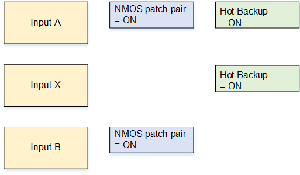

# Resiliency scenario B:

Supporting NMOS patching and failover

This scenario adds failover to the patching capabilities of scenario A.

Elemental Live can automatically fail over to a third input when the active input (from the
A/B patching pair) fails. The event fails over to a hot backup input that you define
(input X).
Typically, this
input isn't an NMOS input. You define failure conditions for the first
input in the patching pair, which is input A in our example. When these conditions are
present, Elemental Live will fail over to input X when there is a problem with either input in
the A/B patching pair. You must also define failback conditions in input X to trigger
fail back to the A/B patching pair.

Follow this procedure:

1. Create one
   receiver group for the two patching pair inputs (inputs A and B). To create a
   receiver group, see [Create the receiver group](s2110-nmos-create-receiver-group.md "s2110-nmos-create-receiver-group.md").
2. In the Elemental Live event or Conductor Live profile that you are creating, create one SMPTE
   2110 NMOS input (input A), as described in [Create a receiver group input](s2110-nmos-create-input.md "s2110-nmos-create-input.md"). In the **Advanced** section, set **NMOS patching pair** to **ON**.
3. After input A, create a backup input (input X). There is no requirement for
   input X to be a SMPTE 2110 input. For example, it might be a file input that
   displays a slate. A file input is particularly useful if the cause of the input
   failure is a network failure, because Elemental Live can switch to a file that is stored
   locally on the node.

Make sure input X is the first input immediately after input A. To move input X
up or down the list of inputs, use the up and down arrows on the far right of the
web interface. 4. After input X, create another SMPTE 2110 NMOS input (input B) and select the
same source item that you already attached to input A. Set **NMOS patching
pair** to **ON**. 5. Make these changes in input A:

    * Set **Hot Backup** to **ON**. Ignore
     the **Error Clear Time** and **Failback
     Rule** fields.
    * Click **Add Failover Condition** to create as many
     failover conditions as you want. To create one condition, click
     **Add Failover Condition**. In
     **Description**, choose the type of condition, for
     example **Input Loss**. In **Duration**,
     enter the length of time the condition must continue before the condition
     triggers a failover to input X.

6.  Make these changes in input X:

        * Set **Hot Backup** to **ON**.
        * Enter a time in **Error Clear Time**. After all the
         failover conditions are no longer applicable Elemental Live waits for the specified
         time before it fails back to input A.
        * Choose a **Failback Rule** to specify how Elemental Live fails
         back to input A.

    Don't enable hot backup on input B. Don't enable NMOS patching pair on input
    X.

**Result of this setup**

You now have three inputs in the order A, X, B.

- Patching pair: Inputs A and B each have NMOS patching pair enabled, therefore
  they are a patching pair, even though they are not next to each other.
- Hot-backup pair: Input A and input X both have hot backup enabled. Input A is
  set up with failover conditions. Input X is set up with failback rules. Therefore,
  inputs A and X are a hot-backup pair.

**How patching works at runtime**

The NMOS controller sends a patching request by sending new SDP content for the
receiver group. When Elemental Live receives the request, it sets up the standby input (input B,
for example) with the new content, then switches from the active input (input A) to the
standby input (input B). Input B becomes the active input. The visual impact during the
patch is controlled by the setting of the [Use
make-before-break field](s2110-nmos-configure.md "s2110-nmos-configure.md").

**How failover works at runtime**

If input A is active and it fails, the event fails over to input X, which is the hot
backup for input A Elemental Live stops ingesting input A and starts to ingest input X.

Input X remains the active input until the failback rules (to input A) take effect.
If input X fails before the failback rules come into effect, Elemental Live follows the standard
input failure behavior, which means it will repeat frames and so on, then finally
display a slate.
