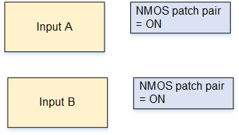

# Resiliency scenario A: Supporting NMOS

patching

With this setup, the NMOS controller can send SDP content that provides patching
instructions to Elemental Live. For example, in a curling match, it can send a patch that
switches the source from the camera on the curling rink to the camera in the studio.

To support NMOS patching, you must attach the same Elemental Live receiver group to two Elemental Live
inputs. Each pair of Elemental Live receiver group inputs is a _patching
pair_. You can set up more than one patching pair in the Elemental Live event or
Conductor Live profile.

To create each patching pair, follow this procedure.

1. Create one receiver group for the patching pair. To create a receiver group,
   see [Create the receiver group](s2110-nmos-create-receiver-group.md "s2110-nmos-create-receiver-group.md").
2. In the Elemental Live event or Conductor Live profile that you are creating, create one SMPTE
   2110 NMOS input (input A), as described in [Create a receiver group input](s2110-nmos-create-input.md "s2110-nmos-create-input.md"). In the **Advanced** section, set **NMOS patching pair** to **ON**.
3. After input A, create another input (input B) and select the same source item
   from the dropdown. In this way, you attach the same receiver group to both inputs.
   Set **NMOS patching pair** to **ON**.
   **Result of this setup**

Elemental Live sets up a _patching pair_ consisting of the
first patching-pair-enabled input (input A in this example) and the next input in the
list that is patching-pair-enabled (input B in this example). Whenever Elemental Live is
ingesting this receiver group content, one of the inputs in the patching pair is
_active_ and the other input is in _standby_.

The two patching-pair inputs must be next to each other. If necessary, use the up and
down arrows on the far right of the web interface to move an input up or down the
list.

**How patching works at runtime**

The NMOS controller sends a patching request by sending new SDP content for the
receiver group that is attached to these two inputs. When Elemental Live receives the request, it
sets up the standby input (input B, for example) with the new content, then switches
from the active input (input A) to the standby input (input B). Input B becomes the
active input. The visual impact during the patch is controlled by the setting of the
[Use make-before-break field](s2110-nmos-configure.md "s2110-nmos-configure.md").
