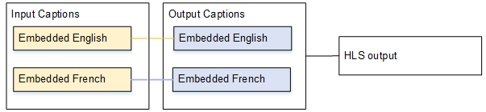
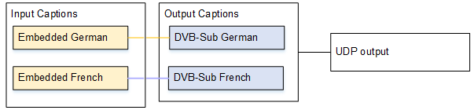

# Typical scenarios

###### Topics

- [Use case: One input format to one output and not converted](#use-case-one-input-format-to-one-output-format-not-converted "#use-case-one-input-format-to-one-output-format-not-converted")
- [Use case: One input format converted to one different format in one
  output](#use-case-one-input-format-to-different-output-formats "#use-case-one-input-format-to-different-output-formats")
- [Use case: One input format converted to different formats, one format
  for each output](#use-case-one-input-format-to-several-output-formats "#use-case-one-input-format-to-several-output-formats")
- [Use case: One captions output shared by multiple video
  encodes](#use-case-one-captions-output-multiple-video-encodes "#use-case-one-captions-output-multiple-video-encodes")
  The following sections describe some typical scenarios for setting up captions in the
  event.

These four scenarios demonstrate a range of use cases.

## Use case: One input format to one output and not converted

In this case, the input is set up with one format of captions and two or more languages
(in the graphic below, you see both English and French.). Assume that you want to maintain
the format in the output, that you want to produce only one type of output, and that you
want to include all languages in that output.

For example, the input has embedded captions in English and French. You want to produce
HLS output that includes embedded captions in both English and French.

## Use case: One input format converted to one different format in one

output

The input is set up with one format of captions and two or more languages. You want to
convert the captions to a different format in the output. You want to produce only one type
of output and include all the languages in that output.

For example, the input has embedded captions in German and French. You want to convert
the captions to DVB-Sub and include these captions in both languages in a UDP output.

## Use case: One input format converted to different formats, one format

for each output

The input is set up with one captions format and two or more languages. Assume that you
want to produce several different types of output, and that in each output you want to
convert the captions to a different format, and include all the languages.

For example, the input has teletext captions in Czech and Polish. You want to produce an
MS Smooth output and an HLS output. In the MS Smooth output, you want to convert both
captions to TTML. In the HLS output, you want to convert both captions to WebVTT.

## Use case: One captions output shared by multiple video

encodes

This use case deals with captions in an ABR workflow. In this example, one captions
output is shared by several video encodes.

For example, assume that there are three video/audio media combinations: one for
low-resolution video, one for medium, and one for high. Assume that there is one output
captions asset (English and Spanish embedded) that you want to associate with all three
video/audio media combinations.

