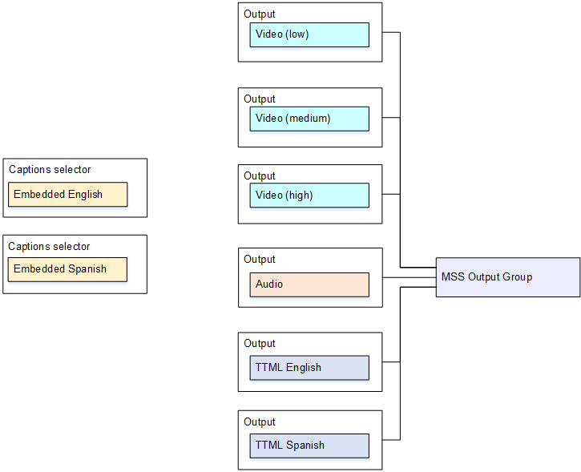

# Use case 4: One captions output shared by multiple video

encodes

This example shows how to set up captions in an ABR workflow. The first setup shows how
to set up an ABR workflow when the captions are in the same output as the video, meaning
that the captions are either embedded or captions style.

The second setup shows how to set up an ABR workflow when the captions belong to the
sidecar category, in which case each captions encode is in its own output.

## Event setup with

embedded or object-style captions

This example shows how to implement [the fourth use
case](typical-scenarios.md#use-case-one-captions-output-multiple-video-encodes "typical-scenarios.md#use-case-one-captions-output-multiple-video-encodes") from the typical scenarios. For example, you want to produce an HLS output
with three video encodes (one for low-resolution video, one for medium, one for high) and
one audio. You also want to include embedded captions (in English and Spanish) and
associate them with all three video encodes.

###### To use one caption's output in multiple video encodes

1. On the web interface, on the **Event** screen, for
   **Input Settings**, choose **Add captions
   selector** to create one captions selector. Set **Selector
   settings** to **Embedded source**.
2. Create an HLS output group.
3. Create one output and set up the video and audio for low-resolution video.
4. In that same output, create one captions asset with the following:
   - **Captions selector name**: Captions Selector 1.
   - **Captions settings**: One of the Embedded formats.
   - **Language code** and **Language
     description**: Leave blank; with embedded passthrough captions, all the
     languages are included.

5. Create a second output and set up the video and audio for medium-resolution
   video.
6. In that same output, create one captions asset with the following:
   - **Captions selector name**: Captions Selector 1.
   - **Captions settings**: One of the Embedded formats.
   - **Language code** and **Language
     description**: Leave blank; with embedded captions, all the languages
     are included.

7. Create a third output and set up the video and audio for high-resolution
   video.
8. In that same output, create one captions asset with the following:
   - **Captions selector name**: Captions Selector 1.
   - **Captions settings**: One of the Embedded formats.
   - **Language code** and **Language
     description**: Leave blank; with embedded captions, all the languages
     are included.

9. Finish setting up the event and save it.

## Event setup with

sidecar captions

This example shows an ABR workflow where the captions are in sidecars. For example,
you want to produce an MS Smooth output with three video encodes (one for low-resolution
video, one for medium, one for high) and one audio. These encodes are in an MS Smooth
output. You want to ingest embedded captions (in English and Spanish) and convert them to
TTML captions, one for English and one for Spanish.

###### To set up sidecar captions

1. On the web interface, on the **Event** screen, for
   **Input Settings**, choose **Add captions
   selector** twice, to create the following captions selectors:
   - Captions selector 1: for Embedded English.
   - Captions Selector 2: for Embedded Spanish.

2. Create an MS Smooth output group.
3. Create one output that contains one video encode and set it up for low-resolution
   video.
4. Create a second output that contains one video encode and set it up for
   medium-resolution video.
5. Create a third output that contains one video encode and set it up for
   high-resolution video.
6. Create a fourth output that contains one audio encode and no video encode.
7. Create a fifth output that contains one captions encode and no video or audio
   encodes and with the following settings for the captions encode:
   - **Captions selector name**: Captions Selector 1.
   - **Captions settings**: TTML.
   - **Language code** and **Language
     description**: English.

8. Create a sixth output that contains one captions encode and no video or audio
   encodes, and with the following settings for the captions encode:
   - **Captions selector name**: Captions Selector 2.
   - **Captions settings**: TTML.
   - **Language code** and **Language
     description**: Spanish.

9. Finish setting up the event and save it.
