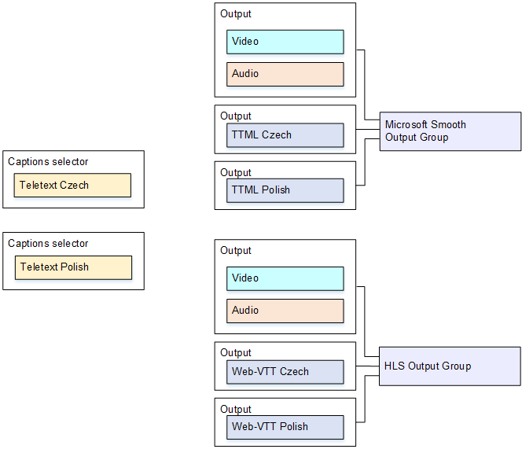

# Use case 3: One input format converted to different formats, one

format for each output

This example shows how to implement [the third use case](typical-scenarios.md#use-case-one-input-format-to-several-output-formats "typical-scenarios.md#use-case-one-input-format-to-several-output-formats")
from the typical scenarios. The input is set up with one format of captions and two or more
languages. You want to produce several different types of output. In each output, you want
to convert the captions to a different format but include all the languages.

For example, the input has teletext captions in Czech and Polish. Assume that you want
to produce an MS Smooth output and an HLS output. Assume that in the MS Smooth output, you
want to include one video and one audio and you want to convert the captions to TTML. In the
HLS output, you want to include one video and one audio and you want to convert the captions
to WebVTT.

## Event setup

###### To convert the input format to a different format for each output

1.  On the web interface, on the **Event** screen, for
    **Input Settings**, choose **Add captions
    selector** twice, to create the following captions selectors:

        * Captions Selector 1 for teletext Czech. Specify the page that holds the Czech
         captions.
        * Captions Selector 2 for teletext Polish. Specify the page that holds the
         Polish captions.

    Although you are including this captions in two different outputs (MS Smooth and
    HLS), you need to extract them from the input only once, so you need to create only
    one captions selector for each language.

2.  Create a MS Smooth output group and configure it as follows:
    - Create one output and set up the video and audio.
    - Create a second output that contains one captions encode and no video or audio
      encodes and with the following settings:
      - **Captions selector name**: Captions Selector 1.
      - **Captions settings**: TTML.
      - **Language code** and **Language
        description**: Czech.
      - **Style control**: Set as desired.

    - Create a third output that contains one captions encode and no video or audio
      encodes, with the following settings:
      - **Captions selector name**: Captions Selector 2.
      - **Captions settings**: TTML.
      - **Language code** and **Language
        description**: Polish.
      - Other fields: same as the second output (the Czech captions).

3.  Create an HLS output group and configure it as follows:
    - Create one output and set up the video and audio.
    - Create a second output that contains one captions encode and no video or audio
      encodes and with the following settings:
      - **Captions selector name**: Captions Selector 1.
      - **Captions settings**: WebVTT.
      - **Language code** and **Language
        description**: Czech.
      - Other fields: Set as desired.

    - Create a third captions output that contains one captions encode and no video
      or audio encodes and with the following settings:
      - **Captions selector name**: Captions Selector 2.
      - **Captions settings**: WebVTT
      - **Language code** and **Language
        description**: Polish.
      - Other fields: same as the second output (the Czech captions).

4.  Finish setting up the event and save it.
