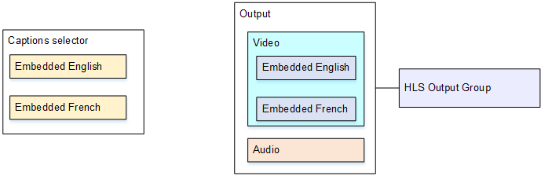

# Use case 1:

one input format to one output

This example shows how to implement [the first use
case](typical-scenarios.md#use-case-one-input-format-to-one-output-format-not-converted "typical-scenarios.md#use-case-one-input-format-to-one-output-format-not-converted") from the typical scenarios. The input is set up with one format of captions
and two or more languages. Assume that you want to maintain the format in the output and
that you want to produce only one type of output and include all the languages in that
output.

For example, the input has embedded captions in English and French. You want to produce
an HLS output that includes embedded captions in both English and French, plus one video and
one audio.

This example illustrates two important features of an embedded passthrough workflow.
First, you do not create separate captions selectors; all of the languages are all
automatically included. Second, if you are outputting to HLS, you have an opportunity to
specify the languages and the order in which they appear.

## Event setup

###### To maintain the input format on output

1. On the web interface, on the **Event** screen, for
   **Input settings**, choose **Add captions
   selector** to create one captions selector. Set **Selector
   settings** to **Embedded source**.
2. In the **Output Groups** section, create an HLS output
   group.
3. Create one output and set up the video and audio.
4. In that same output, create one captions asset with the following:
   - **Captions selector name**: Captions selector 1.
   - **Captions settings**: One of the Embedded formats.
   - **Language code** and **Language
     description**: Leave blank; with embedded captions, all the languages
     are included.

5. In the HLS output group, in **Captions**, in **Captions
   language setting**, choose **Insert**.
6. For **HLS settings**, in **Captions language
   mappings**, choose **Add captions language mappings**
   twice (once for each language).
7. Complete the first group of mapping fields with `1`,
   `ENG`, and `English` and the second group
   with `2`, `FRE`, and
   `French`.
8. Finish setting up the event and save it.
