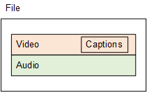
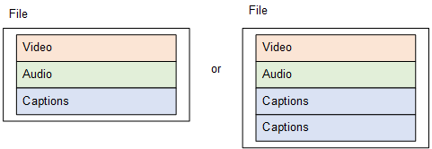
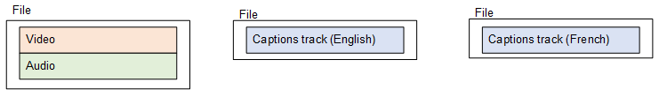

This is version 2.18 of the AWS Elemental Server documentation.
This is the latest version. For prior versions, see
the _Previous Versions_ section of [AWS Elemental Conductor File and AWS Elemental Server Documentation](../../../elemental-server.md "../../../elemental-server.md").

# About Captions Handling in Outputs

Depending on the output captions format, AWS Elemental Server creates the captions differently in
the outputs. Find information about each captions output format in the following table. Find
details about each handling method in the sections following the table.

| Output Captions Format | What AWS Elemental Server Creates in the Job Output                                                                                                                                                                                                                                          |
| ---------------------- | -------------------------------------------------------------------------------------------------------------------------------------------------------------------------------------------------------------------------------------------------------------------------------------------- | ---------------------------------------------------------------------------------------------------------------------------------------------------------------------------------------------------------------------------------------------------------------------------------------------------------------------------------------------------------------------------------------------------------------------------------------------------------------------------------------------------------------------------------------------------------------------------------------------------------------------------------------------------------------------------------------------------------------------------------------------------------------------------------------------------------------------------------------------------------------------------------------------------------------------------------------------------------------------------------------------------------------------------------------------------------------------------------------------------------------------------------------------------------------------------------------------------------------------------------------------------------------------------------------------------------------------------------------------------------------------------------------------------------------------------------------------------------------------------------------------------------------------------------------------------------------------------------------------------------------------------------------------------------------------------------------------------------------------------------------------------------------------------------------------------------------------------------------------------------------------------------------------------------------------------------------------------------------------------------------------------------------------------------------------------------------------------------------------------------------------------------------------------------------------------------------------------------------------------------------------------------------------------------------------------------------------------------------------------------------------------------------------------------------------------------------------------------------------------------------------------------------------------------------------------------------------------------------------------------------------------------------------------------- |
| Ancillary+Embedded     | The captions in ancillary format are in the ancillary data in the stream. The embedded captions are embedded in the video. To choose Ancillary+Embedded, choose **Embedded** as the **Destination Type** . AWS Elemental Server automatically produces both Ancillary and embedded captions. |
| ARIB                   | AWS Elemental Server creates a separate captions object in the output.                                                                                                                                                                                                                       |
| Burn-in                | AWS Elemental Server writes the captions permanently into the video frames, replacing pixels of the original video with the words.                                                                                                                                                           |
| CFF-TT                 | AWS Elemental Server creates a separate captions object in the output.                                                                                                                                                                                                                       |
| DVB-Sub                | AWS Elemental Server creates a separate captions object in the output.                                                                                                                                                                                                                       |
| Embedded               | AWS Elemental Server embeds the captions inside the output video stream.                                                                                                                                                                                                                     |
| Embedded+SCTE-20       | AWS Elemental Server embeds the captions inside the output video stream.                                                                                                                                                                                                                     |
| RTMP CaptionInfo       | AWS Elemental Server creates a separate captions object in the output.                                                                                                                                                                                                                       |
| RTMP CuePoint          | AWS Elemental Server creates a separate captions object in the output.                                                                                                                                                                                                                       |
| SCC                    | AWS Elemental Server creates a separate sidecar file for each captions track.                                                                                                                                                                                                                |
| SCTE-20+Embedded       | AWS Elemental Server embeds the captions inside the output video stream.                                                                                                                                                                                                                     |
| SMI                    | AWS Elemental Server creates a separate sidecar file for each captions track.                                                                                                                                                                                                                |
| SRT                    | AWS Elemental Server creates a separate sidecar file for each captions track.                                                                                                                                                                                                                |
| Teletext               | AWS Elemental Server creates a separate captions object in the output.                                                                                                                                                                                                                       |
| TTML                   | AWS Elemental Server creates a separate sidecar file for each captions track.                                                                                                                                                                                                                |
| WebVTT                 | AWS Elemental Server creates a separate sidecar file for each captions track.                                                                                                                                                                                                                | ## Embedded in Video For embedded, embedded+SCTE-20, and SCTE-20+embedded captions, AWS Elemental Server embeds the captions inside the output video stream. There is only ever one captions object although that object may contain several captions tracks. When you set this up in your job, you specify your captions as a tab in the same stream as your video and audio. You associate one stream with one output. ###### Note The captions format you specify must be supported by the output container you specify for the video. The resulting output from your job is put together as shown in the following diagram.  ## Separate Captions Object For ARIB, CFF-TT, DVB-Sub, RTMP CaptionInfo, RTMP CuePoint, and Teletext captions, AWS Elemental Server creates a separate captions object in the output. Each captions object is a separate captions track or even a separate format. Each format you specify in an output must be supported by the output container. When you set this up in your job, you specify your captions as a tab in the same stream as your video and audio. You associate one stream with one output. You put each output for a given package type or file type in one output group. For example, each rendition in a DASH adaptive bitrate (ABR) stack corresponds to one output in a DASH output group. ###### Note Each captions format you specify must be supported by the output container you specify for the video. The resulting output from your job is put together as shown in the following diagram.  ## Sidecar For SCC, SMI, SRT, TTML, and WebVTT captions, AWS Elemental Server creates a separate sidecar file for each captions track. The captions are each in a separate output, separate from the video and audio that contains one or more streams that contain only captions objects. Each captions stream output is a separate different language or even a separate format (so long as the output container supports that format.). When you set this up in your job, you specify each captions track in a separate, captions-only stream. You associate one stream with one output. You identify sets of outputs that belong together by putting them in the same output group. ###### Note Each captions format you specify must be supported by the output container you specify for the video. The resulting output from your job is put together as shown in the following diagram.  |
