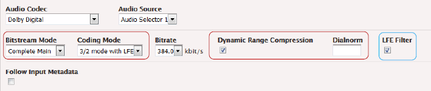
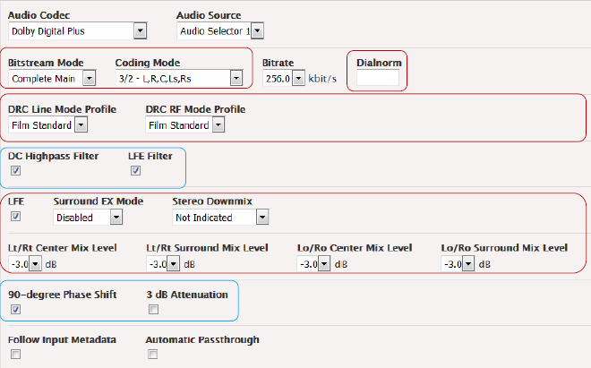

This is version 2.18 of the AWS Elemental Server documentation.
This is the latest version. For prior versions, see
the _Previous Versions_ section of [AWS Elemental Conductor File and AWS Elemental Server Documentation](../../../elemental-server.md "../../../elemental-server.md").

# Setting Up the Profile or Event Using the Web

Interface

This section describes how to set up the project or event using the web interface. To
set up using the REST API, see [Output with the Dolby Digital
Codec](dolby-metadata-output-dolby-digital-codec.md "dolby-metadata-output-dolby-digital-codec.md") and
[Output with Dolby Digital Plus
(EC2, EAC3) Codec](dolby-metadata-output-dolby-digital-plus-codec.md "dolby-metadata-output-dolby-digital-plus-codec.md") to map the fields to their XML
tags according to the following steps.

1. In the Output > Stream section, click the Audio tab to display the fields for
   audio.
2. Choose one of these Audio Sources as appropriate and complete the Audio Codec field:
   Dolby Digital, Dolby Digital Plus or Dolby Digital Pass Through. The fields for metadata
   appear.
3. Complete the remaining fields for the audio source that you selected. See the following to determine how to achieve the desired effect.

**Dolby Digital**
For Dolby Digital, encoder control fields are circled in blue and delivery fields are
circled in red. Note that the LFE Filter field appears only when the Coding Mode is 3/2
mode.

**Dolby Digital Plus**
Encoder Control fields are circled in blue. Delivery fields are circled in red. Note that
the Automatic Pass-through field does not relate to metadata.

Note that the Surround Mode field appears only when Coding Mode is 2/0.

**Dolby Digital Passthrough**
There are no fields for metadata.

## Use the Metadata in the Audio Source – Case

1

| Input Codec                                 | Output Codec                                      | Handling of Audio                                                                                                            |
| ------------------------------------------- | ------------------------------------------------- | ---------------------------------------------------------------------------------------------------------------------------- | ---------------------------------------------------------------------------------------------------------------------------------------------------------------------------------------------------------------------------------------------------------------------------------------------------------------------------------------------------------------------------------------------------------------------------------------------------------------------------------------------------------------------------------------------------------------------------------------------------------------------------------------------------------------------------------------------------------------------------------------------------------------------------------------------------------------------------------------------------------------------------------------------------------------------------------------------------------------------------------------------------------------------------------------------------------------------------------------------------------------------------------------------------------------------------------------------------------------------------------------------------------------------------------------------------------------------------------------------------------- |
| Dolby Digital or Dolby Digital Plus         | Dolby Digital or Dolby Digital Plus               | You are transcoding the audio.                                                                                               |  • **Metadata Parameters** fields: Complete only AWS Elemental Server Control fields, as required for your workflow.  • **Follow Input Metadata** field: Check this field after completing the Metadata Parameter fields. **Result for Metadata** AWS Elemental Server Control parameters from the profile are applied during transcoding (given that the input does not include these parameters). If a given parameter is not exposed in the profile, a default value is always applied; see [Output with the Dolby Digital Codec](dolby-metadata-output-dolby-digital-codec.md "dolby-metadata-output-dolby-digital-codec.md") and [Output with Dolby Digital Plus (EC2, EAC3) Codec](dolby-metadata-output-dolby-digital-plus-codec.md "dolby-metadata-output-dolby-digital-plus-codec.md"). The Delivery parameters from the input metadata are included in the output. ## Use the Metadata in the Audio Source – Case 2                                                                                                                                                                                                                                                                                                                                                                                                                        |
| Input Codec                                 | Output Codec                                      | Handling of Audio                                                                                                            |
| ---                                         | ---                                               | ---                                                                                                                          |
| Dolby Digital or Dolby Digital Plus         | Dolby Digital or Dolby Digital Plus (Passthrough) | You are passing through the audio.                                                                                           |  • **Metadata Parameters** fields: Not applicable.  • **Follow Input Metadata** field: No Encoder Control parameters are applied (because no transcoding occurs). **Result for Metadata** The Delivery parameters from the input metadata will be included in the output. ## Use the Metadata in the Audio Source – Case 3                                                                                                                                                                                                                                                                                                                                                                                                                                                                                                                                                                                                                                                                                                                                                                                                                                                                                                                                                                                                                           |
| Input Codec                                 | Output Codec                                      | Handling of Audio                                                                                                            |
| ---                                         | ---                                               | ---                                                                                                                          |
| Mix of Dolby Digital Plus and another codec | Dolby Digital Plus                                | You are passing through the Dolby Digital Plus audio and transcoding the remainder (Automatic Passthrough field is checked). |  • **Metadata Parameters** field: Complete all the parameters.  • **Follow Input Metadata** field: Check this field after completing the metadata fields. **Result for Metadata**  • AWS Elemental Server Control parameters from the profile will be applied when transcoding the non-Dolby Digital Plus audio.  • No Encoder Control parameters will be applied when passing through the Dolby Digital Plus audio.  • The Delivery parameters from the profile will be used when transcoding the non-Dolby Digital Plus audio.  • The Delivery parameters from the audio source will be used for the passed-through Dolby Digital audio. ## Use the Metadata in the Audio Source – Case 4                                                                                                                                                                                                                                                                                                                                                                                                                                                                                                                                                                                                                                              |
| Input Codec                                 | Output Codec                                      | Handling of Audio                                                                                                            |
| ---                                         | ---                                               | ---                                                                                                                          |
| Dolby E                                     | Dolby Digital or Dolby Digital Plus               | You are transcoding the audio.                                                                                               |  • **Metadata Parameters** fields: Ignore.  • **Follow Input Metadata** field: Check. **Result for Metadata (Versions up to 2.9)**  • AWS Elemental Server Control parameters from the profile are applied during transcoding.  • The Delivery parameters from the profile are included in the output.  • This behavior is unintentional and has been corrected in version 2.10. **Result for Metadata (Versions 2.10 and later)**  • AWS Elemental Server Control parameters from the input metadata are applied during transcoding.  • The Delivery parameters from the input metadata are included in the output. ## Override the Metadata with New Values – Case 5                                                                                                                                                                                                                                                                                                                                                                                                                                                                                                                                                                                                                                                                |
| Input Codec                                 | Output Codec                                      | Desired Effect                                                                                                               |
| ---                                         | ---                                               | ---                                                                                                                          |
| Any codec                                   | Dolby Digital or Dolby Digital Plus               | To override the metadata in the audio source.                                                                                |  • **Metadata Parameters** field: Complete as desired.  • **Follow Input Metadata** field: Leave unchecked. **Result for Metadata** The values from the profile are used.  • With all parameters except Dialnorm, the values from the profile are used. If a given parameter is not exposed in the profile, a default value is always applied; see [Output with the Dolby Digital Codec](dolby-metadata-output-dolby-digital-codec.md "dolby-metadata-output-dolby-digital-codec.md") and [Output with Dolby Digital Plus (EC2, EAC3) Codec](dolby-metadata-output-dolby-digital-plus-codec.md "dolby-metadata-output-dolby-digital-plus-codec.md").  • With Dialnorm, the value from the profile is used. If the profile has no value and the source is a Dolby file, the value from the input metadata is used. If the profile has no value and the source is _not_ a Dolby file, a default value is used; see [Output with the Dolby Digital Codec](dolby-metadata-output-dolby-digital-codec.md "dolby-metadata-output-dolby-digital-codec.md") and [Output with Dolby Digital Plus (EC2, EAC3) Codec](dolby-metadata-output-dolby-digital-plus-codec.md "dolby-metadata-output-dolby-digital-plus-codec.md"). AWS Elemental Server Control parameters are applied during transcoding. The Delivery parameters are included in the output. |
