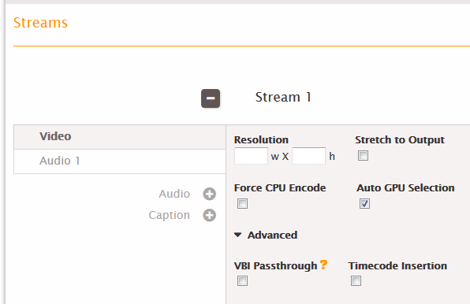

This is version 2.18 of the AWS Elemental Server documentation.
This is the latest version. For prior versions, see
the _Previous Versions_ section of [AWS Elemental Conductor File and AWS Elemental Server Documentation](../../../elemental-server.md "../../../elemental-server.md").

# Extracting VBI Data Included in Embedded Input

Captions

Read this section if all three of the following apply:

- You are extracting embedded captions from the input and using embedded captions in the
  output.
- The input includes VBI data, and
- You want to include all that data in the output.

# Captions in VBI Data

To include embedded captions in this scenario, you do not create caption selectors and
associate them with the desired output. Instead, follow this procedure:

1. Create an output for the asset that is to include VBI data.
2. Go to that Stream section.
3. Display the Video fields for this stream. Click **Advanced**. More
   fields appear.

 4. Check the **VBI Passthrough** field. 5. Do not create a captions tab in this stream.
All the VBI data (including embedded captions) from the input is included in the output
that is associated with this stream.
