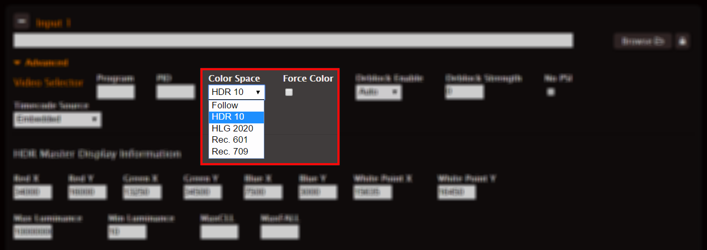
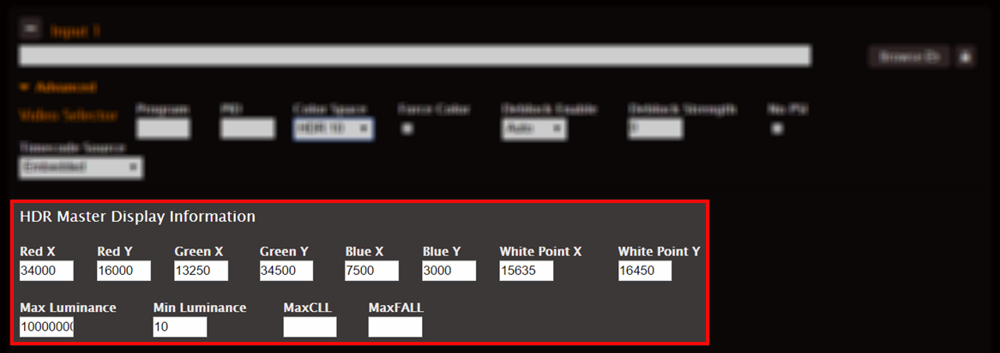

This is version 2.18 of the AWS Elemental Server documentation.
This is the latest version. For prior versions, see
the _Previous Versions_ section of [AWS Elemental Conductor File and AWS Elemental Server Documentation](../../../elemental-server.md "../../../elemental-server.md").

# Input >

Advanced: Managing Overwrite of Source Metadata

Use the controls under Input > Advanced to either provide missing metadata or to
replace incorrect metadata. The new values are passed into every output.

To do this, choose the Force Color checkbox under Input > Advanced and choose the
correct color space in the Color Space dropdown box. Do not select
**Follow** from the Color Space dropdown box.

If you leave the Force Color checkbox unchecked, AWS Elemental Server ignores the
value in the Color Space dropdown box and any values provided in the HDR Master
Display Information (shown below).

## For HDR10 Input Only

If you select HDR10 in the Color Space dropdown box, the HDR Master Display
Information fields appears below. Enter correct values in these fields. Make
sure to check the Force Color checkbox (described above) to incorporate these
values in your metadata.

If you leave Force Color unchecked, these HDR Master Display Information
fields still show values, but these values are not used. AWS Elemental Server
instead uses metadata values from the incoming stream. You can view these values
in the media info display after the job starts.

