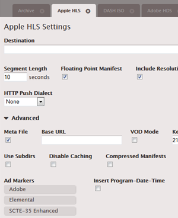
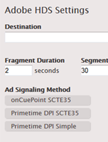
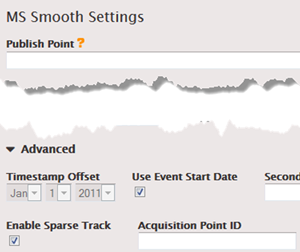

This is version 2.18 of the AWS Elemental Server documentation.
This is the latest version. For prior versions, see
the _Previous Versions_ section of [AWS Elemental Conductor File and AWS Elemental Server Documentation](../../../elemental-server.md "../../../elemental-server.md").

# Manifest Decoration

You can choose to interpret SCTE-35 messages from the original input and insert
corresponding instructions into the output manifest for the following outputs:

- HLS
- HDS
- MS Smooth (the instructions are inserted in the sparse track).

## How SCTE-35 Events Are

Handled in Manifests

The following information may be inserted into the manifest:

| Type of Instruction | When Inserted                                                                                                                                                                                                                                                                                                                                                                                                               |
| ------------------- | --------------------------------------------------------------------------------------------------------------------------------------------------------------------------------------------------------------------------------------------------------------------------------------------------------------------------------------------------------------------------------------------------------------------------- |
| Base-64             | Information about all SCTE-35 messages in the output is incorporated into the manifest; the entire SCTE-35 message is added in base-64 format.                                                                                                                                                                                                                                                                        |
| Cue-out, Cue-in     | SCTE-35 messages that are ad avails (see [Getting Ready: Setting the Ad Avail Mode](getting-ready-setting-the-ad-avail-mode.md "getting-ready-setting-the-ad-avail-mode.md")) result in the insertion of “cue-out, cue-in” instructions.                                                                                                                                                                              |
| Blackout            | Only applies to the SCTE-35 Enhanced ad marker style (for HLS output; see below). SCTE-35 messages that are \*not • ad avails result in the insertion of “blackout start/end” instructions, assuming that blackout is enabled ([Ad Avail Blanking and Blackout](ad-avail-blanking-and-blackout.md "ad-avail-blanking-and-blackout.md")). If blackout is not enabled, these instructions are not inserted. |

###### Splice Insert Mode

This table describes which of the three types of instructions are inserted for
each message type/segmentation type.

| Message Type ID                    | Segmentation Type ID               | Base 64 | Cue-out, Cue-in | Blackout |
| ---------------------------------- | ---------------------------------- | ------- | --------------- | -------- |
| Splice insert                      | No segmentation descriptor present | X       | X               |          |
| Provider advertisement             | X                                  | X       |                 |
| Distributor advertisement          | X                                  | X       |                 |
| Placement opportunity              | X                                  | X       |                 |
| Other type (e.g. Chapter, Program) | X                                  |         | X               |
| Time signal                        | Provider advertisement             | X       | X               |          |
| Distributor advertisement          | X                                  | X       |                 |
| Placement opportunity              | X                                  | X       |                 |
| Other type (e.g. Chapter, Program) | X                                  |         | X               |

###### Timesignal APOS Mode

This table describes which of the three types of instructions are inserted for
each message type/segmentation type. Note that many segmentation types are completely
ignored: they do not get included in the manifest.

| Message Type ID                    | Segmentation Type ID   | Base 64 | Cue-out, Cue-in | Blackout |
| ---------------------------------- | ---------------------- | ------- | --------------- | -------- |
| Splice insert                      | Any                    | X       |                 |          |
| Time signal                        | Provider advertisement | X       |                 |          |
| Distributor advertisement          | X                      |         |                 |
| Placement opportunity              | X                      | X       |                 |
| Other type (e.g. Chapter, Program) | X                      |         | X               |

## Procedure to Enable Manifest

Decoration

###### Apple HLS

Manifest decoration is enabled at the output group level, which means that the
manifests for all outputs in that group include instructions based on the SCTE-35
content.

In the Apple HLS output group section, open the Advanced section and complete the
following fields:

- **Ad Markers**: Click to select a marker type. You can select
  more than one type.

See [Example Manifests for Apple HLS](example-manifests-hls.md "example-manifests-hls.md") for
information about the different types of markers.

The manifest for each output includes a separate set of tags for each type that you
select.

###### HDS

Manifest decoration is enabled at the output group level, which means that the
manifests for all outputs in that group include instructions based on the SCTE-35
content.

In the Adobe HDS output group section, open the Advanced section and complete the
following fields:

- **Ad Markers**: Click to select a marker type. You can select
  more than one type.

The manifest for each output includes a separate set of tags for each type that you
select.

###### MS Smooth

With MS Smooth, if you enable manifest decoration, instructions are actually
inserted in the sparse track.

Manifest decoration is enabled at the output group level, which means that the sparse
tracks for all outputs in that group include instructions based on the SCTE-35
content.

In the MS Smooth output group section, complete the following fields:

- **Enable Sparse Track**: Click to select a marker type. You
  can select more than one type.
- **Acquisition Point ID**: Enter the address of the
  certificate if encryption is enabled on the output.

