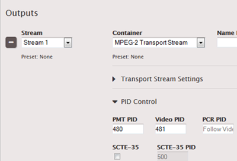
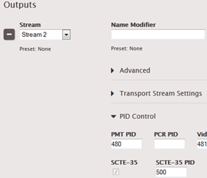

This is version 2.18 of the AWS Elemental Server documentation.
This is the latest version. For prior versions, see
the _Previous Versions_ section of [AWS Elemental Conductor File and AWS Elemental Server Documentation](../../../elemental-server.md "../../../elemental-server.md").

# Passthrough or Removal of SCTE Messages from

Input

SCTE-35 messages from the input can be passed through (included) in the data stream for
the following outputs.

- Archive outputs with MPEG-2 as the container.
- **HLS**: You specify whether to pass through at the
  output group level: passthrough or removal applies globally to all outputs in the
  output group.
- **UDP/TS**: You specify whether to pass through at
  the output level: for each individual output in the output group.

## Archive

Passthrough is enabled or disabled at the output level: only in outputs that have an
MPEG-2 TS container.

1. In the Profile or Event screen, go to the Output Groups section at the bottom
   of the screen and display the tab for Archive Output Group.
2. In the output that has the MPEG-2 TS container, open the PID Control section.
   Complete the following fields:
   - **SCTE-35**: Click to check.
   - **SCTE-35 PID**: Enter the ID of the PID where you want
     the SCTE-35 messages to go.

###### Result

All SCTE-35 messages from the input are included in the data stream of this
output.

## Apple HLS

Passthrough is enabled or disabled individually for each output, which means it can
be applied differently for different outputs in the same group.

1. If you have not already set up for manifest decoration, do so now; see [Procedure to Enable Manifest
   Decoration](manifest-decoration.md#procedure-to-enable-decoration "manifest-decoration.md#procedure-to-enable-decoration").
2. In the Profile or Event screen, go to the Output Groups section at the bottom
   of the screen and display the tab for Apple HLS Output Group.
   1. In each output, open the PID Control section. You will note that the
      SCTE-35 field is automatically checked (because you set up for manifest
      decoration); it cannot be unchecked.
   2. Complete the following field:
      - **SCTE-35 PID** field: Enter the ID of the PID
        where you want the SCTE-35 messages to go.

###### Result

All SCTE-35 messages from the input are included in the data stream of the
relevant output.

## UDP/TS

Passthrough is enabled or disabled individually for each output, which means it can
be applied differently for different outputs in the same group.

1. In the Profile or Event screen, go to the Output Groups section at the bottom
   of the screen and display the tab for UDP/TS Output Group.
2. In the output where you want to pass through SCTE-35 messages, open the PID
   Control section. Complete the following fields:
   - **SCTE-35**: Click to check.
   - **SCTE-35 PID**: Enter the ID of the PID where you want
     the SCTE-35 messages to go.

###### Result

All SCTE-35 messages from the input are included in the data stream of the
relevant output.
