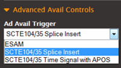
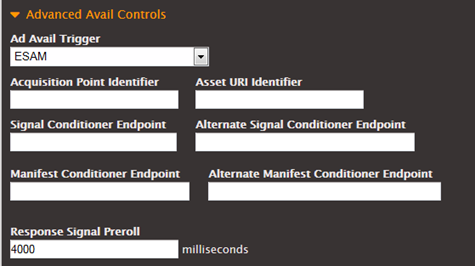

This is version 2.18 of the AWS Elemental Server documentation.
This is the latest version. For prior versions, see
the _Previous Versions_ section of [AWS Elemental Conductor File and AWS Elemental Server Documentation](../../../elemental-server.md "../../../elemental-server.md").

# POIS Conditioning

You can configure AWS Elemental jobs to communicate with a POIS server. During
processing of the input, each time a SCTE-35 message is encountered, the AWS Elemental
encoder sends the message contents to the server. The POIS responds with SCTE-35 content
that may be identical to, slightly different from, or completely different from the
original.

The AWS Elemental encoder also supports handling of “out-of-band” SCTE-35 messages from
the POIS – messages that are not in response to a message originally sent by the AWS Elemental encoder. If such a message is received, the AWS Elemental encoder accepts and
processes it.

## Effect of POIS Conditioning

When you enable POIS conditioning, an extra step is inserted into the regular
processing of the SCTE-35 messages. The job’s ad avail mode, of manifest
decoration, of ad avail blanking, of blackout and of SCTE-35 passthrough still apply to
some degree.

You should read the other SCTE-35 topics and the following to determine how POIS
conditioning changes the standard behavior.

###### Ad Avail Mode

When POIS conditioning is enabled, the ad avail mode is always set to “splice
insert.” For information about the implications for manifest decoration and ad avail
blanking that are performed by the AWS Elemental encoder, see [Getting Ready: Setting the Ad
Avail Mode](getting-ready-setting-the-ad-avail-mode.md "getting-ready-setting-the-ad-avail-mode.md").

###### SCTE-35 Messages Inserted by REST API

All these messages are sent to the POIS along with messages that were already in the
input.

###### New or Conditioned SCTE-35 Messages

The POIS can send an instruction to insert a new SCTE-35 message, modify an existing
one, or delete an existing one. A message received from the POIS may include any message
type and segmentation type.

###### Manifest Decoration

The effect of POIS conditioning on manifest decoration is as follows:

- **HLS Outputs** – A message received from the
  POIS may include instructions to decorate an HLS manifest (not other types of
  manifests). This information is used to decorate the HLS manifest.

How the AWS Elemental encoder processes the decoration information depends on how
the job has been configured:

    + If the job does not have manifest decoration enabled for HLS outputs,
     then the information is ignored.
    + If the job does have it enabled, then the decoration information is
     inserted in the manifest.
    + The information is inserted into the manifest “as is.” The style of the
     information may not match the styles (ad marker styles) specified in the
     job. The AWS Elemental encoder does not check for format inconsistencies
     between these instructions and the ad marker style.

- **Other Outputs** – Decoration of other
  manifest types occurs according to the information in the SCTE-35 message, how the
  AWS Elemental encoder job is set up for manifest decoration, and which ad
  avail mode is enabled. The POIS conditioning has no effect on these manifest types.

###### Blanking and Blackout

The effect of POIS conditioning on blanking and blackout is as follows:

- **Extra Blackout Instructions** – A message
  received from the POIS may include explicit “blank the content corresponding to this
  SCTE-35 message” instructions for any SCTE-35 message.

Even if blanking or blackout (whichever applies to the message type and
segmentation descriptor type) is disabled in the encoder, the AWS Elemental encoder
observes the instruction for this specific message.

- **Blanking Image** – A POIS response may
  include reference to a blanking .png or .bmp file. The AWS Elemental encoder uses
  this file for any blanking/blackout if it can find the file at /data/server/esam/ on
  the AWS Elemental node.

If the encoder cannot find the file, it uses a black slate.

- **Restriction Flags** – The Override
  restriction flags in the AWS Elemental job (**Ignore Web Delivery
  Allowed** flag and **Ignore No Regional Blackout** flag)
  are always set to unchecked in ESAM mode. See [Ad Avail Blanking and Blackout](ad-avail-blanking-and-blackout.md "ad-avail-blanking-and-blackout.md").
- **Passthrough or Removal** – If passthrough is
  enabled in the AWS Elemental job, all SCTE-35 messages are passed through,
  according to the rule.

But when POIS conditioning is enabled, the POIS can override this rule: if the
POIS instruction is to remove a given SCTE-35 message, then that message is removed
and is not passed through, even though passthrough is enabled in the AWS Elemental
encoder.

## Procedure to Enable POIS

Conditioning

1. In the Profile or Job screen, click Advanced Avail Controls (in the Input
   section towards the top of the screen):

 2. In Ad Avail Trigger, choose ESAM. More fields appear.

 3. Complete the fields as follows:

    1. Complete the first 6 fields to identify the endpoints on the POIS.
    2. For **Response Signal Preroll**, change the value as
     desired, to set the distance (in milliseconds) between the time that the
     SCTE-35 message is inserted and the start time of that ad avail.
