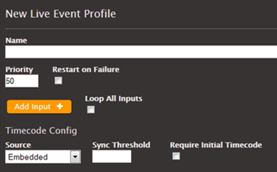

This is version 2.18 of the AWS Elemental Server documentation.
This is the latest version. For prior versions, see
the _Previous Versions_ section of [AWS Elemental Conductor File and AWS Elemental Server Documentation](../../../elemental-server.md "../../../elemental-server.md").

# SCTE Processing Options

AWS Elemental Server supports the following processing possibilities.

###### Blanking and Blackout

The “cue out” and “cue in” instructions in SCTE-35 messages line up with specific
content in the video, audio, and closed captions streams. You can set up so that this
content is blanked out in the output.

- The content for ad avails is blanked out using the Ad avail _blanking_ feature.
- The content for other messages is blanked out using the _Blackout_ feature.
  You must set up the desired behavior in the job or profile.

###### SCTE-35 Message Passthrough

SCTE-35 messages can be included in the output data stream in any TS output. You must
set up the desired behavior in the job or profile.

###### Manifest Decoration

Manifest decoration has the following options:

- HLS and HDS outputs can be set up so that their manifests include instructions
  that correspond to the original SCTE-35 message content.
- MS Smooth outputs can be set up to include these instructions in the sparse
  track.
  You must set up the desired behavior in the job or profile.

###### Conditioning by a POIS

Optionally, SCTE-35 messages can be diverted to a POIS for ESAM conditioning. This
conditioning is in addition to all the other processing (manifest decoration, blanking
and blackout, and passthrough).

POIS and ESAM conditioning are covered in this manual in [POIS Conditioning](pois-conditioning.md "pois-conditioning.md").

## Default Behavior

The default handling of SCTE-35 messages by AWS Elemental Server includes the
following:

- No manifest decoration: Does not convert any SCTE-35 messages to job
  information in any output manifests or data streams.
- No passthrough: Does not pass through SCTE-35 messages in any data stream
  outputs.
- No blanking: Does not blank out video content for any jobs: leave the
  content as is.

If you want this default behavior in all of your outputs, you can submit your job
without adjusting any SCTE-35 settings.

## About Timecode Configuration

and Timers

The job or profile includes a **Timecode Configuration** field that identifies the source for time code stamps to be inserted in the
output. The source for these stamps may be a timecode embedded in the input or may be a
source external to the input (for example, the system clock or a specified time).

Before starting the transcode, the transcoder gets the timecode from the
source.

After the initial sampling, AWS Elemental Server calculates the timecode of every frame
and attaches it to the output. The timecode stops advancing if there is no output. So,
for example, if the input fails at 10:55:03:009, the timecode at that point is
10:55:009. If the input restarts 3 seconds later, the timecode of the next frame may be
10:55:03:012. The timecode will _not_ be
10:55:**06**:009.

Given the importance of accurate times with SCTE-35 messages, it is important to have
NTP (Network Time Protocol) configured on the node.
