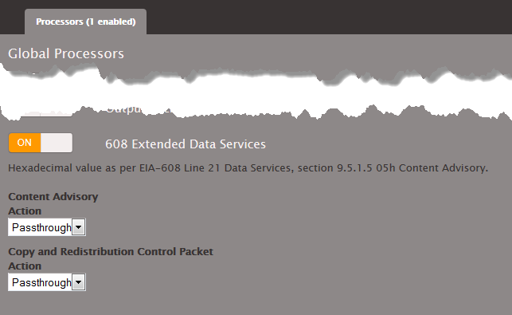

This is version 2.18 of the AWS Elemental Server documentation.
This is the latest version. For prior versions, see
the _Previous Versions_ section of [AWS Elemental Conductor File and AWS Elemental Server Documentation](../../../elemental-server.md "../../../elemental-server.md").

# Setting Up Input Captions With 608 XDS

Data

The Extended Data Services (XDS or EDS) standard is part of EIA-608 and allows for the
delivery of ancillary data.

If your content includes 608 XDS data, you can set up to include it or strip it from the
output.

###### Note

The data is global – it is either included in every output and stream (even those
streams that do not include captions) or it is excluded in every output and stream.

# Extracting Data from Input

1. In the Input section of the job, click **Advanced**.
2. Click the Add Caption Selector button.
3. Set the source to **Null**.

You only need to create one Caption Selector for 608 XDS data, regardless of the number
of outputs you are creating. 4. If you also want to extract regular captions, create more Caption Selectors according to
the regular procedure as described in [Creating Input Captions Selectors](create-input-caption-selectors.md "create-input-caption-selectors.md").

# Including Data in Output

- In the Global Processors section, turn on **608 Extended Data
  Services** and complete the fields as desired.

###### Note

No setup is required in the captions section of the output or the streams.
