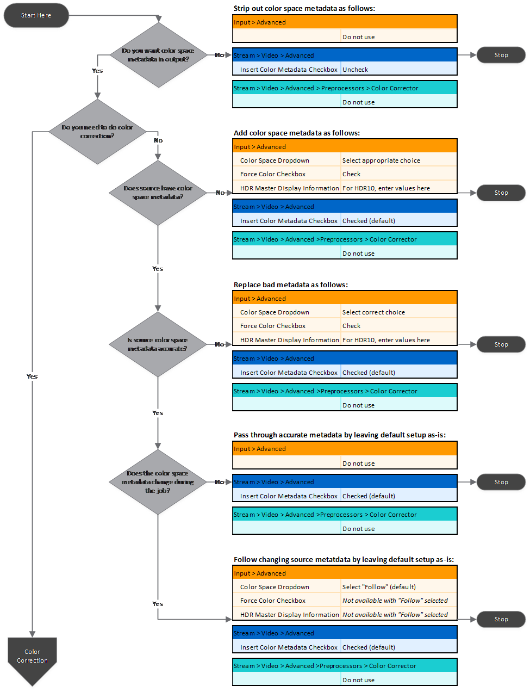
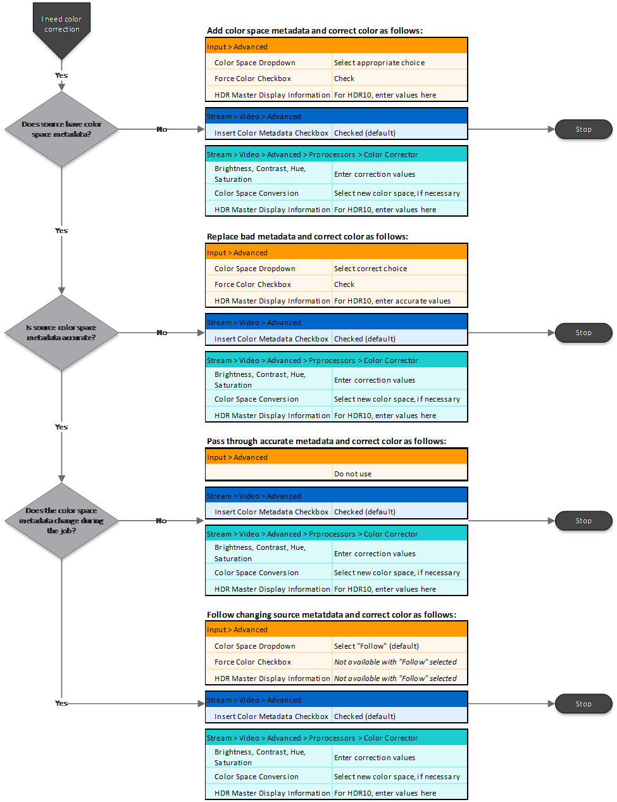

This is version 2.18 of the AWS Elemental Server documentation.
This is the latest version. For prior versions, see
the _Previous Versions_ section of [AWS Elemental Conductor File and AWS Elemental Server Documentation](../../../elemental-server.md "../../../elemental-server.md").

# Setting Up HDR Jobs Using

the Web Interface

Use the following flowchart to determine which fields in the job or profile you need
to adjust to get the HDR functionality that you need. Then find detailed instructions
and screenshots in the sections that follow.

