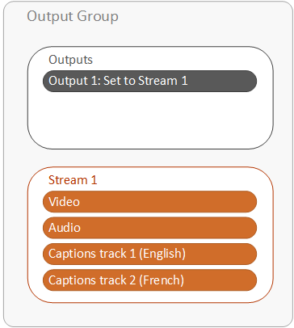
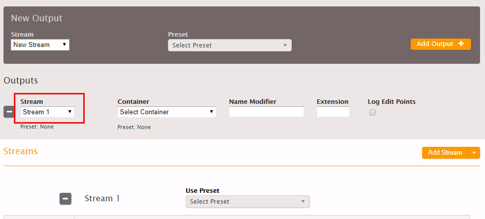
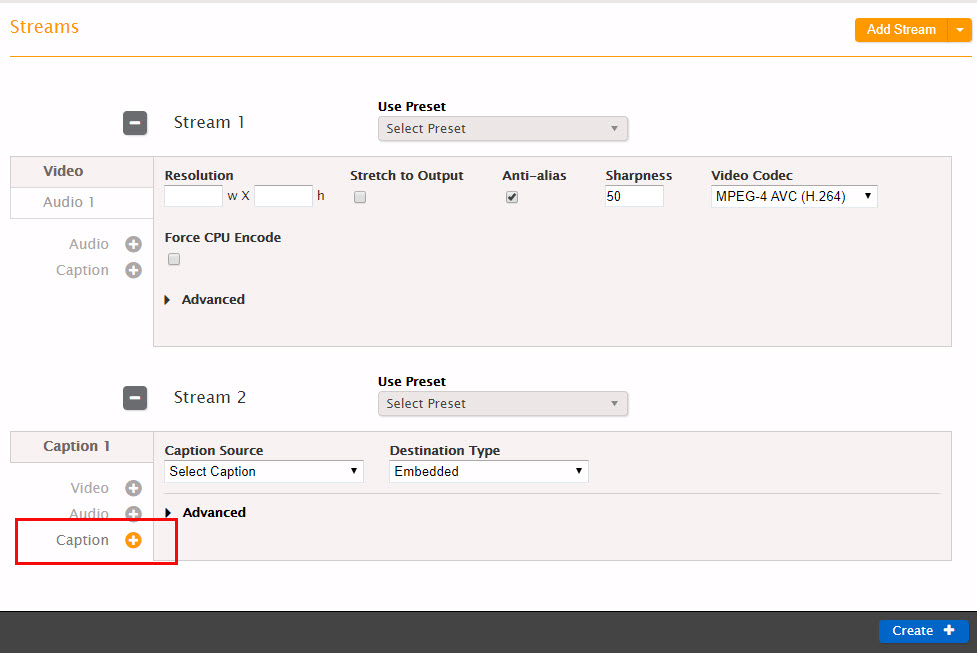

This is version 2.18 of the AWS Elemental Server documentation.
This is the latest version. For prior versions, see
the _Previous Versions_ section of [AWS Elemental Conductor File and AWS Elemental Server Documentation](../../../elemental-server.md "../../../elemental-server.md").

# Setting Up Output Captions for All

Formats Except Sidecar

To set up output captions in any format other than sidecar, you add captions tabs to the
stream that also contains the video and audio. You associate the one stream with one output. On
the AWS Elemental Server web interface, your outputs are structured as shown in the following diagram.
Depending on the output captions format, AWS Elemental Server creates the captions differently in the
outputs. For more information about the job output results for different captions
formats, see [About Captions Handling in Outputs](caption-handling.md "caption-handling.md").

###### To set up captions in an output, all caption formats except sidecar

1. On the **Create New Job** page, find the very light gray **Output Groups**
   section at the bottom of the job.
2. Choose the output group tab that contains the output to which you want to add
   captions.

If you have not already set up the video and audio for the outputs in this output group,
set them up first,before you set up the captions. 3. Find the stream associated with the output. You can see the stream name in the value for
**Stream** in the output.

 4. Choose **Caption +**.

 5. Specify values for the captions track settings as described in the table following this
procedure. 6. Create an additional captions tabs in the same stream and output for each additional
captions track you want to include. 7. Repeat this procedure for any other outputs you want to include captions in.

###### Note

If your output captions are embedded and your output package (that is, your output group
type) is HLS, you can optionally include captions language information in the manifest. For
more information, see [Setting up the HLS Manifest](set-up-the-hls-manifest.md "set-up-the-hls-manifest.md").

| Field                      | Applicability                                                                                                                                                                                | Description                                                                                                                                                                                                                                                                                                                                                  |
| -------------------------- | -------------------------------------------------------------------------------------------------------------------------------------------------------------------------------------------- | ------------------------------------------------------------------------------------------------------------------------------------------------------------------------------------------------------------------------------------------------------------------------------------------------------------------------------------------------------------ |
| **Caption Source**         | All                                                                                                                                                                                          | Select the caption selector you created when specifying the input captions (see [Creating Input Captions Selectors](create-input-caption-selectors.md "create-input-caption-selectors.md")).                                                                                                                                                                 |
| **Destination Type**       | All                                                                                                                                                                                          | Select the caption type. This type must be valid for your output type as per the relevant Supported Captions table.                                                                                                                                                                                                                                          |
| **Pass Style Information** | If **Destination Type** is CCF-TT or TTML. And if the source caption type is an Embedded combination (Embedded, Embedded+SCTE-20, SCTE-20+Embedded), or Teletext, TTML, SMPTE-TT, or CCF-TT. | The choices are: 1. Check this box if you want the style (font, position and so on) of the input captions to be copied. 2. Leave unchecked if you want a simplified caption style. Some client players work best with a simplified caption style. (For other combinations of source caption types and output caption type, the output is always simplified.) |
| Font style fields          | **Destination Type** type is Burn-in or DVB-Sub                                                                                                                                              | For burn-in, see [Font Styles for Burn-in](font-styles-for-burn-in.md "font-styles-for-burn-in.md"). For DVB-Sub, see [(Font Styles for DVB-Sub)](font-styles-for-dvb-sub.md "font-styles-for-dvb-sub.md").                                                                                                                                                  |
| Language                   | All captions except not for embedded-to-embedded or Teletext-to-Teletext                                                                                                                     | Complete if desired. This information may be useful to or required by a downstream system. For embedded-to-embedded or Teletext-to-Teletext, leave as Undefined.                                                                                                                                                                                             |
| Description                | All captions except not for Embedded-to-Embedded                                                                                                                                             | This field is auto-completed after you specify the language.                                                                                                                                                                                                                                                                                                 |
