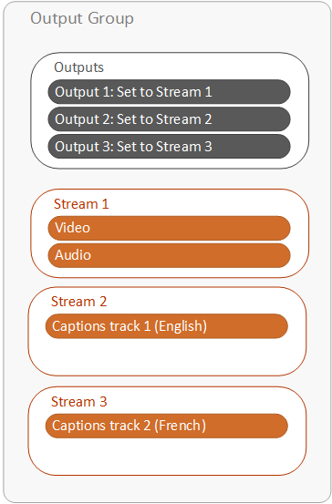
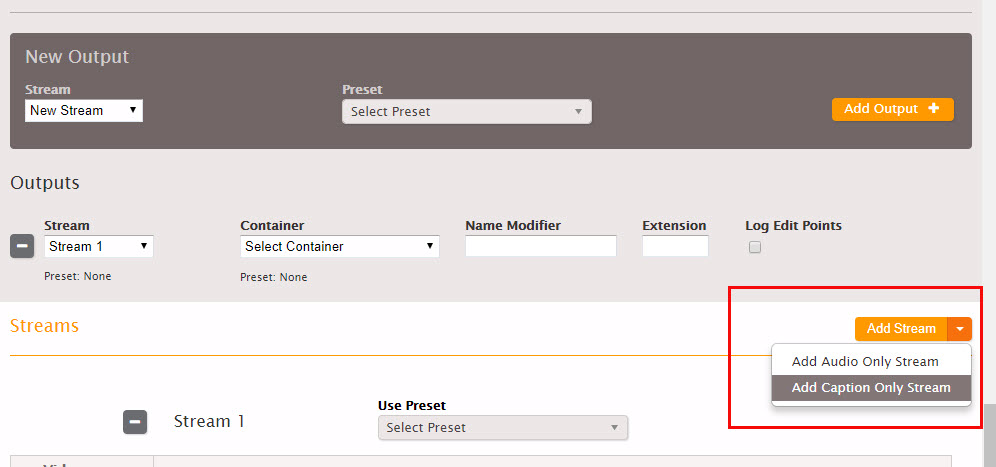

This is version 2.18 of the AWS Elemental Server documentation.
This is the latest version. For prior versions, see
the _Previous Versions_ section of [AWS Elemental Conductor File and AWS Elemental Server Documentation](../../../elemental-server.md "../../../elemental-server.md").

# Setting Up Output Captions in a Sidecar

Format (SCC, SMI, SRT, TTML, WebVTT)

To set up sidecar captions in an output, you create separate, captions-only streams. Each
stream corresponds to one captions track. You set up a separate output to associate with each
stream. On the AWS Elemental Server web interface, your outputs are structured as shown in the
following diagram.

###### To set up sidecar format captions in an output

1. On the **Create New Job** page, find the very light gray **Output Groups**
   section at the bottom of the job.
2. Choose the output group tab that contains the output that you want your sidecar captions
   to go with.

If you have not already set up the video and audio for the outputs in this output group,
set them up first, before you set up the captions. 3. Create a stream for the first captions track that you want to include.

    1. Find the **Streams** section on the tab for your output group below
     the **Outputs** section.
    2. In the upper right corner of the **Streams** section, choose the
     arrow beside the **Add Stream** button. This brings up a drop-down
     menu.

    ###### Note

    Do not choose the **Add Stream** button itself.

    
    3. From the drop-down menu, choose **Add Captions Only Stream**.
    4. Specify values for the settings in the stream as described in the table following this
     procedure.

4. Create a new output and associate your captions-only stream with it.

###### Note

AWS Elemental Server associates this output with your audio and video output because they are
in the same output group.

    1. Find the dark gray **New Output** section on your output group tab,
     just above the **Outputs** section.
    2. For **Stream**, choose the captions-only stream you created earlier in
     this procedure.
    3. Choose the orange **Add Output** button.

5. Create an additional captions-only stream and output for each additional captions track
   you want to include. Associate each stream with an output.

| Field                | Applicability                                                                                                                                         | Description                                                                                                                                                                                                                                                                                                                                                                                                                                                         |
| -------------------- | ----------------------------------------------------------------------------------------------------------------------------------------------------- | ------------------------------------------------------------------------------------------------------------------------------------------------------------------------------------------------------------------------------------------------------------------------------------------------------------------------------------------------------------------------------------------------------------------------------------------------------------------- |
| **Caption Source**   | All                                                                                                                                                   | Select the caption selector you created when specifying the input captions. For more information see [Creating Input Captions Selectors](create-input-caption-selectors.md "create-input-caption-selectors.md"))                                                                                                                                                                                                                                                 |
| **Destination Type** | All                                                                                                                                                   | Select the caption type. This type must be valid for your output type as per the relevant Supported Captions table.                                                                                                                                                                                                                                                                                                                                              |
| **Framerate**        | If the \*_Destination Type_ • is SCC.                                                                                                              | Complete this field to ensure that the captions and the video are synchronized in the output. Specify a framerate that matches the framerate of the associated video. • If the video framerate is 23.97 or 24, choose the corresponding option • If the video framerate is 29.97, choose 29.97 dropframe only if the video has the **Video Insertion\* • and **Drop Frame Timecode\* • both checked; otherwise, choose 29.97 non-dropframe. |
| **Pass-style**       | If \*_Destination Type_ • is TTML. And if: • The source caption type is TTML, SMPTE-TT, or CCF-TT. • And the output is an Archive output. | Complete as follows: • Check this box if you want the style (font, position, and so on) of the input captions to be copied. • Leave unchecked if you want a simplified caption style. Some client players work best with a simplified caption style. (For other combinations of source caption types and output caption type, the output is always simplified.)                                                                                   |
| Font style fields    | If the Destination Type is Burn-in.                                                                                                                   | See [Font Styles for Burn-in](font-styles-for-burn-in.md "font-styles-for-burn-in.md").                                                                                                                                                                                                                                                                                                                                                                             |
| Language             | All                                                                                                                                                   | Complete if desired. This information may be useful to or required by a downstream system.                                                                                                                                                                                                                                                                                                                                                                       |
| Description          | All                                                                                                                                                   | Complete if desired. This information may be useful to or required by a downstream system.                                                                                                                                                                                                                                                                                                                                                                       |
