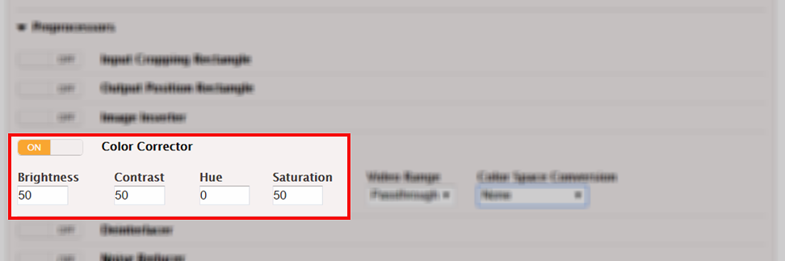
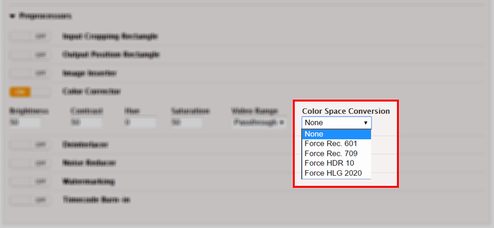
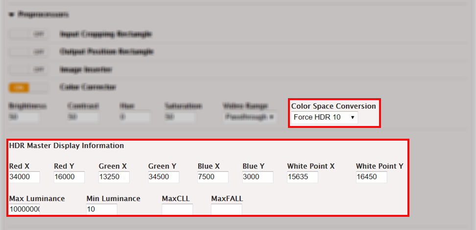

This is version 2.18 of the AWS Elemental Server documentation.
This is the latest version. For prior versions, see
the _Previous Versions_ section of [AWS Elemental Conductor File and AWS Elemental Server Documentation](../../../elemental-server.md "../../../elemental-server.md").

# Stream > Video

> Advanced > Preprocessors > Color Corrector

Access the color correction control as follows:

1. Choose **Advanced** on the Video tab of a stream.
2. Scroll down and choose **Preprocessors** to open a list
   of available preprocessors
3. Choose the slider switch labeled **Color
   Corrector**.
   If you need to do color correction, use the Color Corrector preprocessor.

Color correction is calculated using the values in these fields and the color
metadata from the input. The input metadata depends on your input settings. If you
check the Force Color checkbox (described in the orange section, above), color
correction is calculated from the metadata you supply. If you leave the Force Color
checkbox unchecked, color correction is calculated from the source-supplied
metadata.

Because the color correction checkbox is in the Streams section, you can apply
color correction for some outputs and not others. Settings in the Color Corrector
preprocessor apply to any output associated with the stream.

## Brightness, Contrast, Hue,

Saturation

Enter color correction values in these fields. AWS Elemental Server uses these
values to do color correction regardless of whether you choose to do color space
conversion as well.Color space conversion is discussed below.

## Color Space Conversion

The Color Space Conversion dropdown box is located on the right side of the
Color Corrector section. Use this dropdown to create output streams encoded with
a different standard than the input stream. Select the option for the format you
are converting to. (The format you are converting from is determined by the
input.)

AWS Elemental Server supports the following conversions:

- Between the two HDR formats (HDR10 and HLG)
- Between the two SDR color spaces (rec. 601 and rec. 709)
- From either SDR color space to either HDR format

## HDR Master Display

Information

The HDR Master Display Information fields appear when you select “Force HDR
10” from the Color Space Conversion dropdown list. If you are converting to
HDR10, use these fields to supply master display information metadata to be
included in the output.

