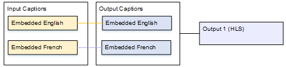
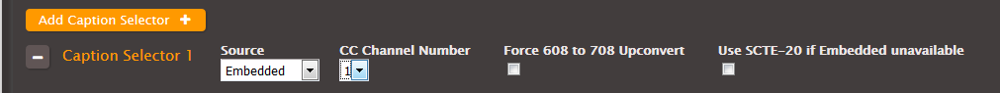
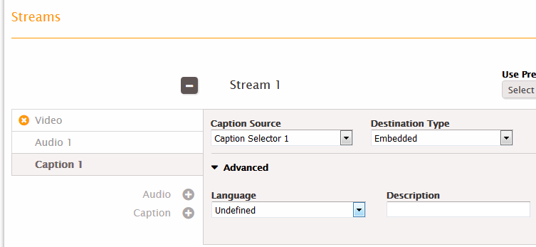
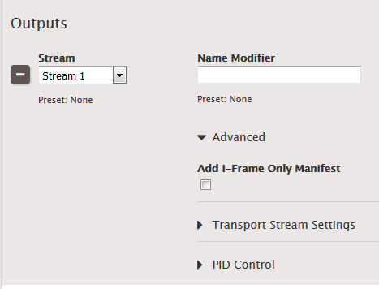
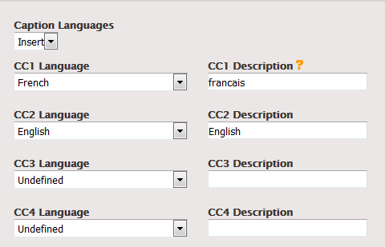

This is version 2.18 of the AWS Elemental Server documentation.
This is the latest version. For prior versions, see
the _Previous Versions_ section of [AWS Elemental Conductor File and AWS Elemental Server Documentation](../../../elemental-server.md "../../../elemental-server.md").

# One Input Format to the Same Output

Format, One Output

The input is set up with one format of captions and two or more languages. You want to
maintain the format in the output. You want to produce only one type of output and include all
the languages in that output.

## Example: Pass Through Embedded Captions

to an HLS Output

The input has embedded captions in English and Spanish. You want to produce HLS output
that includes embedded captions in both English and Spanish.

This example illustrates two important features of an embedded-to-embedded workflow.
First, you do not create separate caption selectors; all of the languages are all automatically
included. Secondly, if you are outputting to HLS, there is an opportunity to specify the
languages and the order in which they appear.

# To set up a job for this example

1. In the input, follow the procedure in [Creating Input Captions Selectors](create-input-caption-selectors.md "create-input-caption-selectors.md") to create one caption selector for Embedded.

 2. Create a stream (for example, Stream 1) and set up the video and audio. 3. In that same stream, set up a captions tab as described in the topic [Setting Up Output Captions for All
Formats Except Sidecar](setting-up-output-captions-not-sidecar.md "setting-up-output-captions-not-sidecar.md") . Create one captions tab only and specify
the settings as follows:

    * **Caption Source**: Caption Selector 1.
    * **Destination Type**: Embedded.
    * **Language**: Leave blank; with embedded captions, all the languages
     are included.

 4. In the HLS output group, create an output. In the Output section, set the Stream field in
that output to Stream 1.

 5. Still in the Output Group section (not in the Output section), click
**Advanced**. In Caption Languages, choose **Insert**. The
CC Language fields appear:

    * Set up CC1 as English.
    * Set up CC2 as French.

 6. Save the job.
