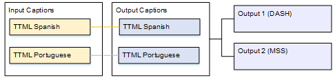
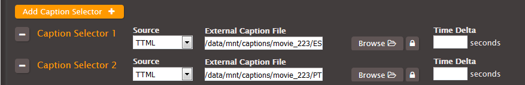
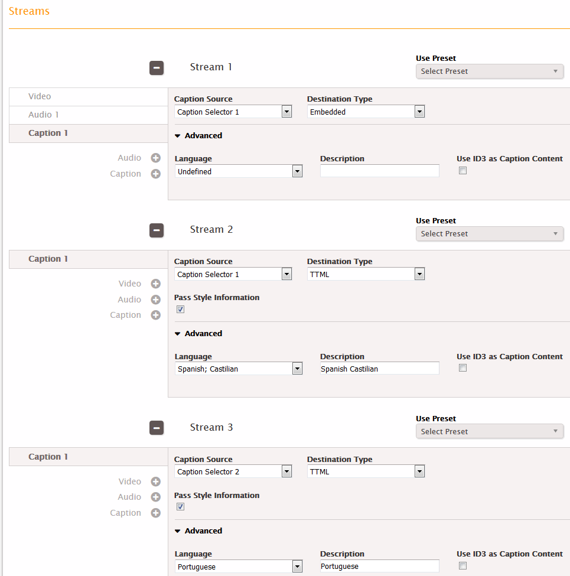
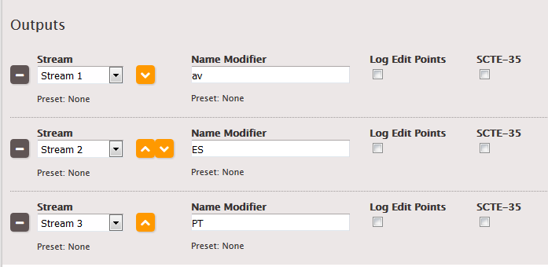

This is version 2.18 of the AWS Elemental Server documentation.
This is the latest version. For prior versions, see
the _Previous Versions_ section of [AWS Elemental Conductor File and AWS Elemental Server Documentation](../../../elemental-server.md "../../../elemental-server.md").

# One Input Format to the Same

Output Format, Multiple Outputs

The input is set up with one format of captions and two or more languages. You want to
maintain the format in the output. You want to produce several different types of outputs and
include all the languages in all the outputs.

## Example: Pass Through Two TTML Tracks, Multiple

Outputs

The input has TTML captions in Spanish and Portuguese. You want to produce a DASH output
and an MSS output. You want the DASH output to include the TTML captions in both Spanish and
Portuguese and the MSS output to also include the TTML captions in both Spanish and
Portuguese.

# To set up a job for this example

1. In the input, follow the procedure in [Creating Input Captions Selectors](create-input-caption-selectors.md "create-input-caption-selectors.md") to create two caption selectors:
   - One for TTML Spanish.
   - One for TTML Portuguese.

 2. Create a stream (for example, Stream 1) and set up the video and audio. 3. Create a captions-only stream (for example, Stream 2) following the procedure for sidecar
captions in the topic [Setting Up Output Captions in a Sidecar
Format (SCC, SMI, SRT, TTML, WebVTT)](setting-up-output-captions-sidecar.md "setting-up-output-captions-sidecar.md"). Specify the captions settings as
follows:

    * **Caption Source**: Caption Selector 1.
    * **Destination Type**: TTML.
    * **Language**: Spanish.
    * **Pass Style Information**: Set it as desired, but you must set both
     languages identically.
    * **Use ID3 as Caption Content**: Leave unchecked.

4. Create a second captions-only stream (for example, Stream 3), specifying the captions
   settings as follows:
   - **Caption Source**: Caption Selector 2.
   - **Language**: Portuguese.
   - Other fields: Same as the first caption stream.

 5. In the DASH output group, create three outputs:

    * In the first output, set the Stream field in that output to Stream 1.
    * In the second output, set the Stream field in that output to Stream 2.
    * In the third output, set the Stream field in that output to Stream 3.

Although there are three outputs, they are all in the same output group, so the
video/audio and two captions are kept together.

 6. In the MSS output group, create three outputs:

    * In the first output, set the Stream field in that output to Stream 1.
    * In the second output, set the Stream field in that output to Stream 2.
    * In the third output, set the Stream field in that output to Stream 3.

Notice that the streams in this output are also associated with the DASH output.

 7. Save the job.
