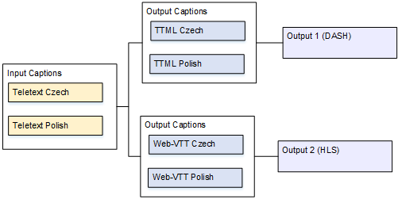
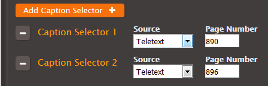
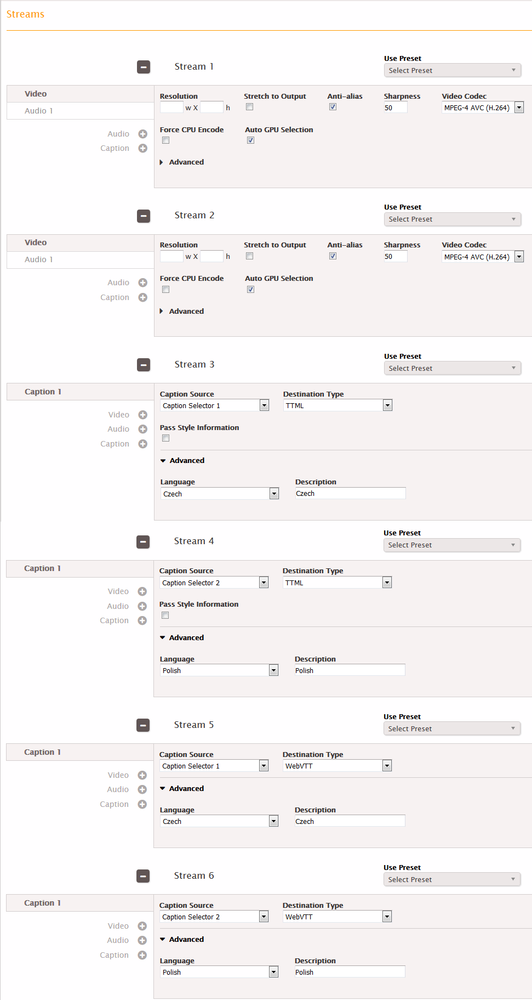
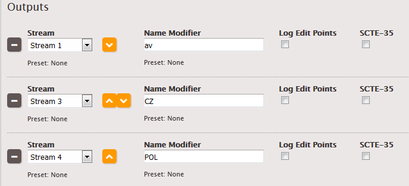
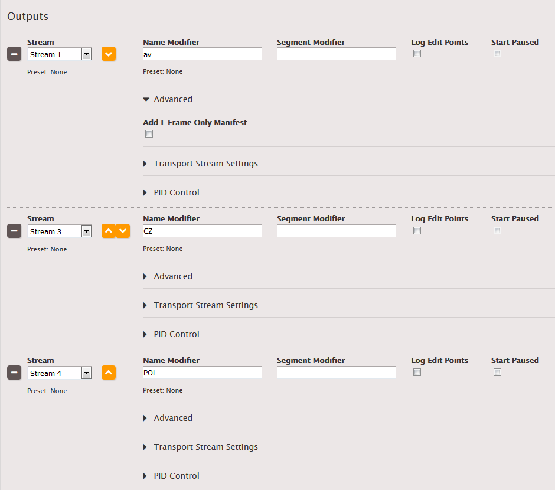

This is version 2.18 of the AWS Elemental Server documentation.
This is the latest version. For prior versions, see
the _Previous Versions_ section of [AWS Elemental Conductor File and AWS Elemental Server Documentation](../../../elemental-server.md "../../../elemental-server.md").

# One Input Format to Multiple Different Formats, One for Each Output

The input is set up with one format of captions and two or more languages. You want to
produce several different types of output. In each output, you want to convert the captions to a
different format but include all the languages.

## Example: Two SRT Tracks to TTML

and WebVTT

For example, the input has SRT captions in Czech and Polish. You want to produce a DASH
output and an HLS output. In the DASH output, you want to convert the same Teletext captions to
TTML and include both languages. In the HLS output, you want to convert the same SRT captions
to WebVTT and include both languages.

This example illustrates an important feature of setting up streams. The two output
captions are TTML and WebVTT. WebVTT cannot be associated with the DASH output, which means
that the stream that holds the WebVTT captions cannot be associated with the DASH output. This
means that you must create two separate streams – one for the video, audio and captions (TTML)
for DASH, another for the video, audio and captions (WebVTT) for HLS.

It looks like this means that the video is being encoded twice – an expensive operation.
But that is not true. So long as the video and audio are set up to be identical in both
streams, the encoder only encodes the video and audio once in the job. The source
captions are, of course, processed twice.

# To set up a job for this example

1. In the input, follow the procedure in [Creating Input Captions Selectors](create-input-caption-selectors.md "create-input-caption-selectors.md") to create two caption selectors:
   - One for Teletext Czech. Specify the page that holds the Czech captions.
   - One for Teletext Polish. Specify the page that holds the Polish captions.

 2. Create a stream (for example, Stream 1) and set up the video and audio. This stream is
associated with the DASH output. 3. Create a second stream (for example, Stream 2) and set up the video and audio in exactly
the same way as Stream 1. This stream is associated with the HLS output. 4. Create one caption stream (for example, Stream 3) following the procedure for sidecar
captions in the topic [Setting Up Output Captions in a Sidecar
Format (SCC, SMI, SRT, TTML, WebVTT)](setting-up-output-captions-sidecar.md "setting-up-output-captions-sidecar.md"). Specify the captions settings as
follows:

    * **Caption Source**: Caption Selector 1.
    * **Destination Type**: TTML.
    * **Language**: Czech.
    * **Pass Style Information**: Set it as desired, but you must set both
     languages identically for all captions (TTML and Teletext).
    * **Use ID3 as Caption Content**: Leave unchecked.

5. Create a second caption stream (for example, Stream 4) in the same way, specifying the
   captions settings as follows:
   - **Caption Source**: Caption Selector 2.
   - **Language**: Polish.
   - Other fields: same as the first caption stream.

6. Create a third caption stream (for example, Stream 5) in the same way, specifying the
   captions settings as follows:
   - **Caption Source**: Caption Selector 1.
   - **Destination Type**: WebVTT.
   - **Language**: Czech.
   - **Pass Style Information**: Set it as desired, but you must set both
     languages identically for all captions (TTML and Teletext).

7. Create a fourth caption stream (for example, Stream 6) in the same way, specifying the
   captions settings as follows:
   - **Caption Source**: Caption Selector 2.
   - **Language**: Polish.
   - Other fields: Same as the third caption stream.

 8. In the DASH output group, create three outputs:

    * In the first output, set the Stream field in that output to Stream 1 (the first
     video/audio stream).
    * In the second output, set the Stream field in that output to Stream 3.
    * In the third output, set the Stream field in that output to Stream 4.

Although there are three outputs, they are all in the same output group, so the
video/audio and two captions are kept together.

 9. In the HLS output group, create three outputs:

    * In the first output, set the Stream field in that output to Stream 2 (the second
     video/audio stream).
    * In the second output, set the Stream field in that output to Stream 5.
    * In the third output, set the Stream field in that output to Stream 6.

Again, although there are three outputs, they are all in the same output group, so the
video/audio and two captions are kept together.

