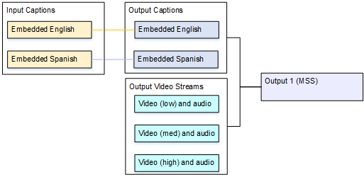
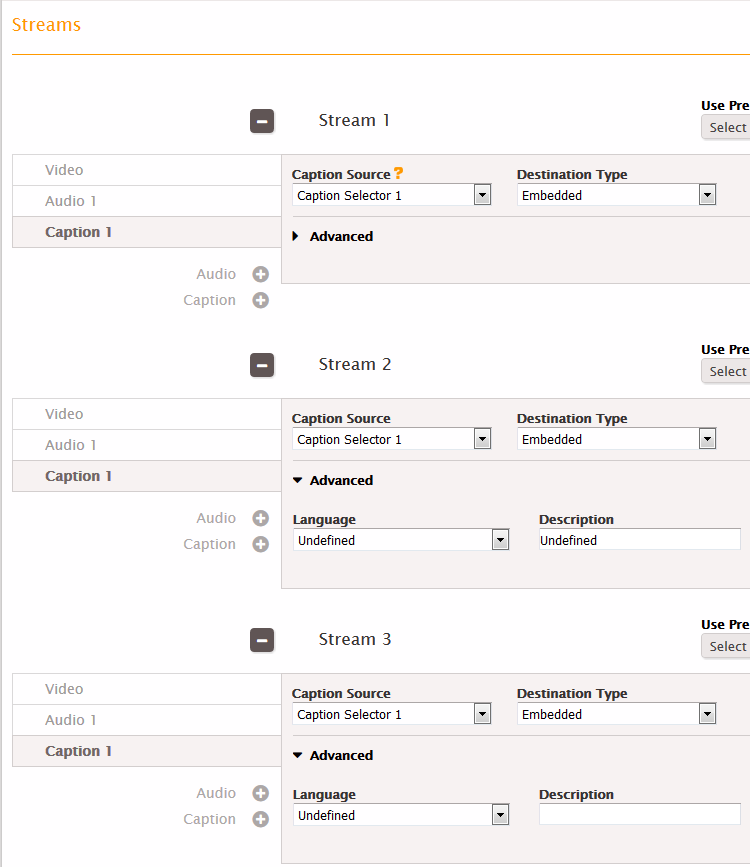
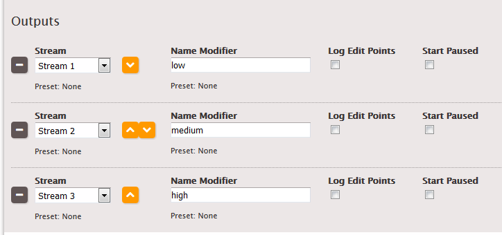
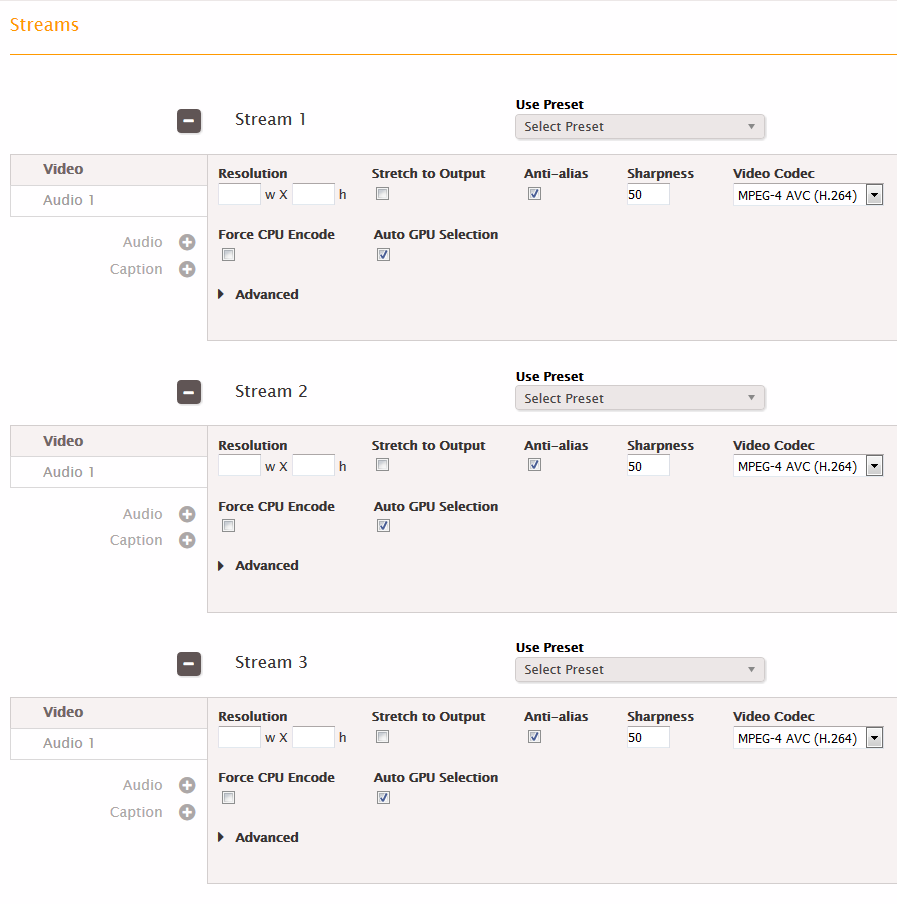
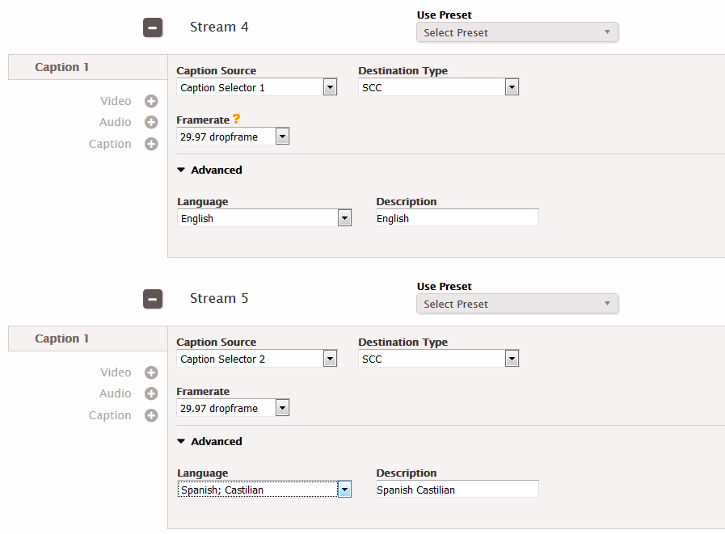
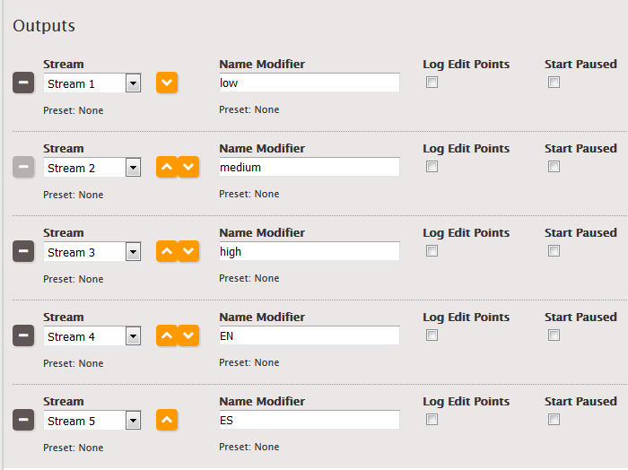

This is version 2.18 of the AWS Elemental Server documentation.
This is the latest version. For prior versions, see
the _Previous Versions_ section of [AWS Elemental Conductor File and AWS Elemental Server Documentation](../../../elemental-server.md "../../../elemental-server.md").

# One Captions

Output Shared Across an Adaptive Bitrate (ABR) Package

These examples show how to set up captions for streaming, adaptive bitrate (ABR) workflows.

## Example: ABR Package with Embedded Output

Captions

In this example, there are three video/audio streams – one for low-resolution video, one
for medium, and one for high. There is one output captions (English and Spanish embedded) that
is associated with all three video/audio streams.

# To set up a streaming output with captions

that are not sidecar

Follow these steps if the captions are embedded in the video or are a captions object in
the same stream as the video and audio.

1. In the input, follow the procedure in [Creating Input Captions Selectors](create-input-caption-selectors.md "create-input-caption-selectors.md") to create one caption selector for Embedded.

 2. Create a stream (for example, Stream 1) and set up the video and audio for low-resolution
video. 3. In that same stream, set up a captions tab as described in the topic [Setting Up Output Captions for All
Formats Except Sidecar](setting-up-output-captions-not-sidecar.md "setting-up-output-captions-not-sidecar.md") . Create one captions tab only and specify
the settings as follows:

    * **Caption Source**: Caption Selector 1.
    * **Destination Type**: Embedded.
    * **Language**: Leave blank; with embedded captions, all the languages
     are included.

4. Create a second stream (for example, Stream 2) and set up the video and audio for
   medium-resolution video.
5. Set up the second stream in the same way, specifying the captions settings as follows:
   - **Caption Source**: Caption Selector 1.
   - **Destination Type**: Embedded.
   - **Language**: Leave blank; with embedded captions, all the languages
     are included.

6. Create a third stream (for example, Stream 3) and set up the video and audio for
   high-resolution video.
7. Set up the third stream in the same way, specifying the captions settings as follows:
   - **Caption Source**: Caption Selector 1.
   - **Destination Type**: Embedded.
   - **Language**: Leave blank; with embedded captions, all the languages
     are included.

 8. In the MSS output group, create three outputs.

    * In the first output, set the Stream field in that output to Stream 1.
    * In the second output, set the Stream field in that output to Stream 2.
    * In the third output, set the Stream field in that output to Stream 3.

 9. Save the job.

## Example: ABR Package with Sidecar Output

Captions

For sidecar output formats, the setup is similar. The only real difference is that each
stream may contain more than one captions tab – for example, one for English, one for Spanish,
one for Portuguese.

# To set up a streaming output with sidecar

captions

Follow these steps if the captions are set up as sidecars – each captions track is in its
own stream.

For example, there are three video/audio streams – one for low-resolution video, one for
medium-resolution, and one for high-resolution. There are two output captions (English and
Spanish SCC) that are associated with all three video/audio streams.

1. In the input, follow the procedure in [Creating Input Captions Selectors](create-input-caption-selectors.md "create-input-caption-selectors.md") to create one caption selector for each language:
   - **Caption Selector 1**: for SCC English.
   - **Caption Selector 2**: for SCC Spanish.

2. Create a stream (for example, Stream 1) and set up the video and audio for low-resolution
   video.
3. Create another stream (for example, Stream 2) and set up the video and audio for
   medium-resolution video.
4. Create another stream (for example, Stream 3) and set up the video and audio for
   high-resolution video.

 5. Set up a captions-only stream (for example, Stream 4) for your first captions track
following the procedure for sidecar
captions in the topic [Setting Up Output Captions in a Sidecar
Format (SCC, SMI, SRT, TTML, WebVTT)](setting-up-output-captions-sidecar.md "setting-up-output-captions-sidecar.md"). Specify the captions settings as
follows:

    * **Caption Source**: Caption Selector 1.
    * **Destination Type**: SCC.
    * **Language**: English
    * **Framerate**rate: As appropriate.

6. Set up another captions-only stream (for example, Stream 5)
   in the same way, specifying the captions settings as follows:
   - **Caption Source**: Caption Selector 2.
   - **Destination Type**: SCC.
   - **Language**: Spanish
   - **Framerate**: As appropriate.

 7. In the MSS output group, create five outputs.

    * In the first output, set the Stream field in that output to Stream 1.
    * In the second output, set the Stream field in that output to Stream 2.
    * In the third output, set the Stream field in that output to Stream 3.
    * In the fourth output, set the Stream field in that output to Stream 4.
    * In the fifth output, set the Stream field in that output to Stream 5.

 8. Save the job.
