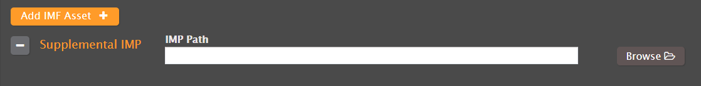
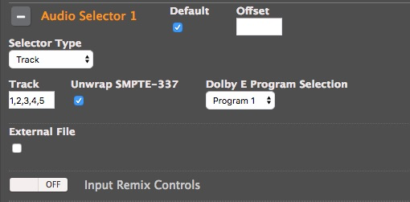
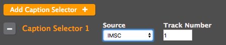

This is version 2.18 of the AWS Elemental Server documentation.
This is the latest version. For prior versions, see
the _Previous Versions_ section of [AWS Elemental Conductor File and AWS Elemental Server Documentation](../../../elemental-server.md "../../../elemental-server.md").

# Using IMF Inputs with AWS Elemental Server

This topic covers the AWS Elemental Server Interoperable Master Format (IMF) App #2 and App
#2E ingest implementation, which was introduced in AWS Elemental Server version 2.13. IMF is a
collection of SMPTE specifications, starting with the prefix ST 2067.

###### Anatomy of an Interoperable Master Package (IMP)

An IMP is just a directory. It must contain an `ASSETMAP.xml` at the root of
the IMP. This file associates file paths with asset UUIDs. All assets must be within the
IMP directory - no relative paths ../, etc. are allowed.

IMPs can have the following status:

- Complete - All of the assets that exist in this IMP.
- Incomplete - CPL refers to assets in another folder.
  A composition playlist (CPL) describes how a version of an asset is presented (within a
  timeline). This timeline is specified similarly to a non-linear edit timeline. It consists of
  a description of what samples play from what files and when. Files are located by the source
  file ID via the `ASSETMAP.xml`s.

###### Feature Limitations

AWS Elemental Server cannot do the following with IMF:

- Ingest IMF applications other than #2 and #2E.
- Write IMF assets.
- Ingest IMSC1 image profile captions.
- Ingest new IMSC1.1 features like skew, top-bottom captions, ruby, etc.
- Burn in IMSC1 captions with styling.
- Parse timecode start time from CPL.

###### Specifying Inputs

To ingest an IMF source, enter the Composition Playlist (CPL) file in the input field.
The extension must be `.xml`.

###### Incomplete IMPs (OV + VF workflows)

If the IMP that contained the specified CPL file is not complete (i.e. it relies on
resources in another IMP), provide paths to the `ASSETMAP.xml` files for every
required supplemental IMP.

For example, you may specify a CPL from a localized version file (VF) of an asset. This VF
IMP replaces captions, audio, and certain video scenes. The CPL still uses to the original
version (OV) video file for most of the timeline.

The user would select the VF CPL as the file input, then add the `ASSETMAP.xml`
of the OV IMP as a supplemental IMP after choosing **Add IMF Asset**.

###### Selecting audio tracks

In the CPL, there are the tracks are specified by track ID (which is a 32-bit UUID).
Instead of using the UUID as the track selector, we relabel the audio tracks internally by
order of incidence (top to bottom) in the CPL and accept the track ID as this
number.

The first audio track that occurs in the CPL (reading top to bottom) is audio that is
selected by audio track 1. The second audio track that occurs in the file is selected by audio
track 2, and so forth. If the audio is mono or the tracks need to be grouped together for
workflow reasons, use a comma-separated list track numbers (for example, 1,2,3,4,5,6 for 5.1
mono).

The default selection is the first track as it occurs in the CPL.

###### Selecting subtitle tracks

Similar to audio track selection, subtitle tracks are specified by track ID (which is a
32-bit UUID). Instead of using the UUID as the track selector, we relabel the subtitle
tracks internally by order of incidence (top to bottom) in the CPL and accept the track ID
as this number.

To select the first subtitle track, click **Add Caption Selector**, change
the source to IMSC, and change the track number to 1.

