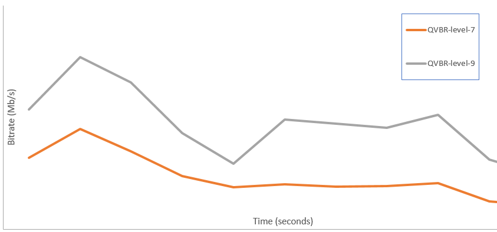

This is version 2.18 of the AWS Elemental Server documentation.
This is the latest version. For prior versions, see
the _Previous Versions_ section of [AWS Elemental Conductor File and AWS Elemental Server Documentation](../../../elemental-server.md "../../../elemental-server.md").

# Using the QVBR Rate Control Mode with AWS Elemental Server

This topic covers the AWS Elemental Server Quality Variable Bitrate (QVBR) implementation,
which was introduced in AWS Elemental Server version 2.13.

The rate control mode that you choose for your output determines whether the encoder uses more data for complex parts of your video or maintains a
constant amount of data per frame. This chapter provides guidance for choosing the right rate control mode for your asset, depending on how you plan to
distribute it. In general, you get the best video quality for a given file size using QVBR for your rate control mode.

Choose QVBR mode for distribution over the internet (OTT) and for video on demand (VOD)
download. For best video quality for your file size, always choose this mode except in the
following cases:

- You need your bit rate to be constant, for example, for distribution over fixed-bandwidth networks
- You need your total file size to not drop below the size that you specify, for example, to comply with contractual or regulatory
  requirements
  When you choose QVBR, the encoder determines the right number of bits to use for each part
  of the video to maintain the video quality that you specify. You can use the same QVBR
  settings for all your assets; the encoder automatically adjusts the file size to suit the
  complexity of the video.

The following graph illustrates how the varying bit rate modes (QVBR and VBR) save
unnecessary bits and provide better quality compared to CBR. The graph shows QVBR versus CBR,
but the same principle applies to VBR:

In the parts of the graph where the QVBR line is above the CBR line, as in the part labeled Area 1, the CBR capped bit rate limits video quality below
that of other scenes, so QVBR gives you more consistent quality. In the parts where the QVBR line drops below the CBR line, as in the part labeled Area
2, a low bitrate is sufficient for the same video quality, so QVBR saves bits and provides the opportunity for cost savings in storage and distribution
through your content delivery network (CDN).

###### Guidelines for Using Quality-Defined Variable Bitrate Mode (QVBR)

When you use QVBR, you specify the quality level for your output and the maximum peak bitrate. For reasonable values of those settings, the encoder
chooses how many bits to use for each part of the video. When you apply the same settings to several assets, your job outputs for simpler assets
(such as cartoons) have smaller file sizes than your outputs for visually complex assets (such as high-motion sports with brightly dressed crowds in
the background).

The following table provides a set of recommended values to get you started:

| Resolution               | Width                                         | Height                                                                                                                                                                                                                                                                                                                                                                                                                             | QVBR Quality Level | Max Bit Rate |
| ------------------------ | --------------------------------------------- | ---------------------------------------------------------------------------------------------------------------------------------------------------------------------------------------------------------------------------------------------------------------------------------------------------------------------------------------------------------------------------------------------------------------------------------- | ------------------ | ------------ | ------------------------------------------------------------------------------------------------------------------------------------------------------------------------------------------------------------------------------------------------------------------------------------------------------------------------------------------------------------------------------------------------------------------------------------------------------------------------------------------------------------------------------------------------------------------------------------------------------------------------------------------------------------------------------------------------------------------------------------- |
| 1080p                    | 1920                                          | 1080                                                                                                                                                                                                                                                                                                                                                                                                                               | 9                  | 6000000      |
| 720p                     | 1280                                          | 720                                                                                                                                                                                                                                                                                                                                                                                                                                | 8                  | 4000000      |
| 720p                     | 1280                                          | 720                                                                                                                                                                                                                                                                                                                                                                                                                                | 7                  | 2000000      |
| 480p                     | 640                                           | 480                                                                                                                                                                                                                                                                                                                                                                                                                                | 7                  | 1000000      |
| 360p                     | 480                                           | 360                                                                                                                                                                                                                                                                                                                                                                                                                                | 7                  | 700000       |
| 240p                     | 352                                           | 240                                                                                                                                                                                                                                                                                                                                                                                                                                | 7                  | 350000       | With all resolutions, don't specify a value for **Max average bitrate** unless you need to guarantee a total file size cap. When you specify a maximum average bit rate, it reduces the benefit that QVBR provides in video quality to file size ratio. To use **Max average bitrate**, you first have to set **Passes** to **2-pass**. ###### Setting QVBR Quality Tuning Level You can specify the QVBR quality level on a scale between 1 and 10. The encoder determines the right number of bits to use for each part of the video to maintain the video quality that you specify. The best value for an output depends on how the output will be viewed. In general, set **QVBR Quality Level** as shown in the following table. |
| Intended Viewing Devices | Recommended QVBR Quality Level for 720p/1080p |                                                                                                                                                                                                                                                                                                                                                                                                                                    | ---                | ---          |
| Large-screen TV          | 8 or 9                                        |                                                                                                                                                                                                                                                                                                                                                                                                                                    | PC or tablet       | 7            |
| Smartphone               | 6                                             | The following graph shows how changing the quality level affects the bit rate that the encoder uses for different parts of the video. While the lines for both level 7 and level 9 spike and drop in the same places, the encoder uses more bits total when the quality is set higher:  |
