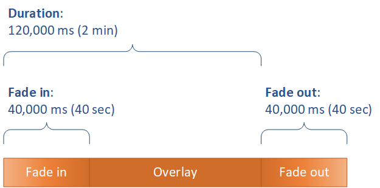

This is version 2.18 of the AWS Elemental Server documentation.
This is the latest version. For prior versions, see
the _Previous Versions_ section of [AWS Elemental Conductor File and AWS Elemental Server Documentation](../../../elemental-server.md "../../../elemental-server.md").

# Setting Up When Your Overlay

Plays

Regardless of whether you specify a still graphic overlay in an input, a stream,
or globally to the job, you set up when it starts and how long it runs by specifying
the **Start time** and **Duration**. The following
image shows how you would specify these settings if you wanted your overlay to start
two minutes into the video and to remain on the video for two minutes. If you keep
these settings in their default state, the overlay begins at the first frame of the
input or output and remains on the video for the duration of the input or
output.

###### Start time

Provide the timecode for the first frame where you want to have the overlay
appear. If you set up your overlay to fade in, set the the fade-in to begin at
the start time.

###### Note

Make sure that you take your timecode source settings into account when you
provide your start time. For input overlays, the input **Input >
Timecode Source** setting affects your overlay start time. For
stream and global overlays, the job-wide **Timecode Config >
Source** setting affects your overlay start time.

Unless you have a reason to set it otherwise, set both of these settings to
**Start at 0** and specify your timecode
counting from 00:00:00:00 at the first frame, as illustrated in this
example.

###### Duration

Specify the length of time, in milliseconds, that you want the overlay to
remain for. This duration includes fade-in time, but not fade-out time, as the
following image shows.

