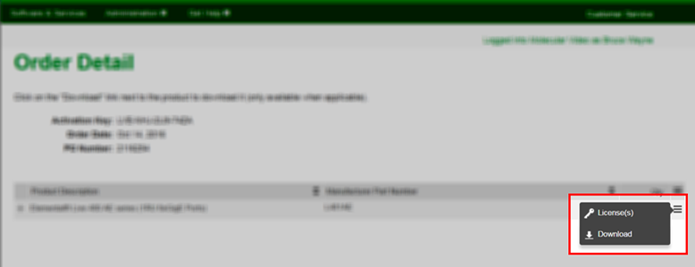
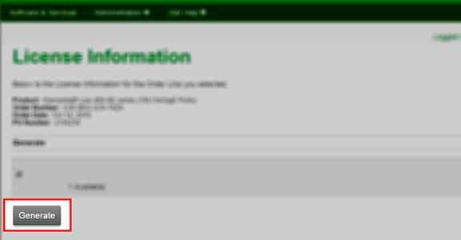
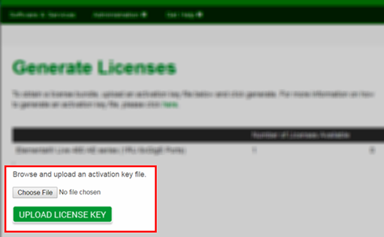
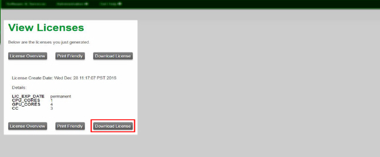

This is version 2.20 of the AWS Elemental Statmux documentation.
This is the latest version. For prior versions, see the
_Previous Versions_ section of [AWS Elemental Statmux
and AWS Elemental Live Documentation](../../../elemental-live.md "../../../elemental-live.md").

# Step c: Download Licenses from the AWS Elemental User Community

1. Follow the instructions in [Downloading AWS Elemental Statmux Software](detailed-dl-sm-ig.md "detailed-dl-sm-ig.md") to get to the **Order Detail** page on the
   [AWS Elemental Support Center Activations](https://console.aws.amazon.com/elemental-appliances-software/home?region=us-east-1#/activations "https://console.aws.amazon.com/elemental-appliances-software/home?region=us-east-1#/activations").
2. Hover over the three-bar icon on the right of the screen to bring up a small menu. Choose **License(s)**.

 3. On the **License Information** page, choose **Generate**.

 4. On the **Generate Licenses** page, select **Choose File** to browse to and select your `.key` file. 5. This returns you to the **Generate Licenses** page,
with your `.key` file selected. Choose **Upload License Key**.

 6. This takes you to the **View Licenses** page, where you can download a `.tgz` file. This is a compressed, aggregated file that contains all the license files that you need for this system.

 7. Save the `.tgz` file to a place accessible to the AWS Elemental system that will be using this license, for example, a directory on your workstation called “licenses”. Make a note of the path.

The files are named `lic-download-<hostname>`.tgz``. 8. Repeat these steps for each hardware unit that will have AWS Elemental software.
