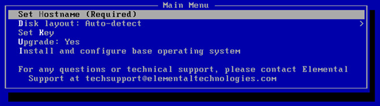

This is version 2.20 of the AWS Elemental Statmux documentation.
This is the latest version. For prior versions, see the
_Previous Versions_ section of [AWS Elemental Statmux
and AWS Elemental Live Documentation](../../../elemental-live.md "../../../elemental-live.md").

# Step B: Install (Kickstart) the Operating System

Software

You must install a configured operating system from an `.iso` file onto each physical machine that will be running AWS Elemental software. Doing so is referred to as “kickstarting the system”.

Make sure that you install the right version of the operating system with each piece of software. The correct `.iso` file is always provided with the
`.run` file under **Activations** at [AWS Elemental Support Center Activations](https://console.aws.amazon.com/elemental-appliances-software/home?region=us-east-1#/activations "https://console.aws.amazon.com/elemental-appliances-software/home?region=us-east-1#/activations").

###### Create a Boot USB Drive or DVD

Do this from your workstation.

Use a third-party utility (such as PowerISO or ISO2USB) to create a bootable DVD or USB drive from your `.iso` file. Instructions for using these utilities can be found in the [AWS Elemental Support Center](https://console.aws.amazon.com/elemental-appliances-software/home?region=us-east-1#/supportcenter "https://console.aws.amazon.com/elemental-appliances-software/home?region=us-east-1#/supportcenter") knowledge base.

###### Install the Operating System at Each Node

Do this from each Elemental node.

1. Insert the DVD or USB thumb drive into the hardware unit.
2. Boot up or reboot the system. The installer automatically starta.

 3. Use the arrow keys to select each option and do the following:

| Menu Option                                   | Instructions                                                                                                                                                               |
| --------------------------------------------- | -------------------------------------------------------------------------------------------------------------------------------------------------------------------------- | ------------------------------------------------------------------------------------------------------------------------------------------------------------------------------------------------------------------------------------------------------------------- |
| `Set Hostname`                                | Change the hostname to a useful name such as `statmux-01` or `statmux-chicago-01`. Do not use localhost as the hostname! Do not use periods or underscores in the hostname |
| `Disk layout: Auto-detect`                    | Leave this set at Auto-detect.                                                                                                                                             |
| `Set Key`                                     | Press the down arrow to skip this option.                                                                                                                                  |
| `Upgrade`                                     | Choose `No`. Choosing `No` deletes all data from the hardware unit. Never choose `Yes` when doing a new install.                                                           |
| `Install and configure base operating system` | Press `Enter` to begin the OS installation.                                                                                                                                | The operating system is installed. From now on, the system runs this customized version of your Linux operating system. 4. Repeat the above steps on each system, using the `.iso` file that goes with the AWS Elementalsoftware you are installing on each system. |
